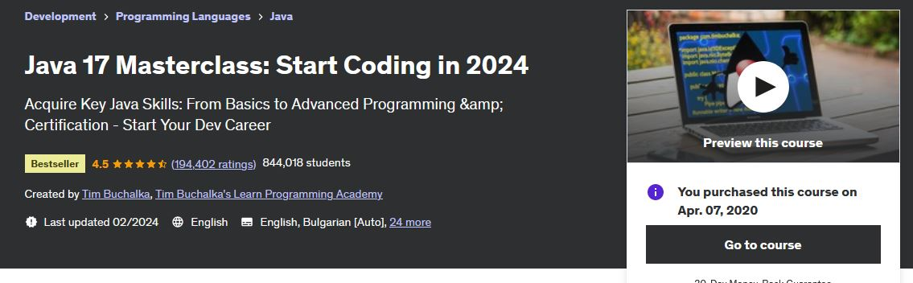

## Java In-Depth Become a Complete Java Engineer!

Refining my Java skils.

## Progress

- [x] 01 - Course Introduction
- [X] 02 - Software Tools Setup
- [ ] 03 - First Steps
- [ ] 04 - Java Tutorial: Expressions, Statements, Code blocks, Methods and more
- [ ] 05 - Control Flow Statements
- [o] 06 - OOP Part 1 - Classes, Constructors and Inheritance
- [o] 07 - OOP Part 2 - Composition, Encapsulation, and Polymorphism
- [o] 08 - Arrays, Java inbuilt Lists, Autoboxing and Unboxing
- [x] 09 - Inner and Abstract Classes & Interfaces
- [x] 10 - Java Generics
- [o] 11 - Naming Conventions and Packages. static and final keywords
- [o] 12 - Java Collections
- [ ] 13 - JavaFX
- [ ] 14 - Basic Input & Output including java.util
- [ ] 15 - Concurrency in Java
- [ ] 16 - 
- [ ] 17 - 
- [ ] 18 - 
- [ ] 19 - 
- [ ] 20 -
