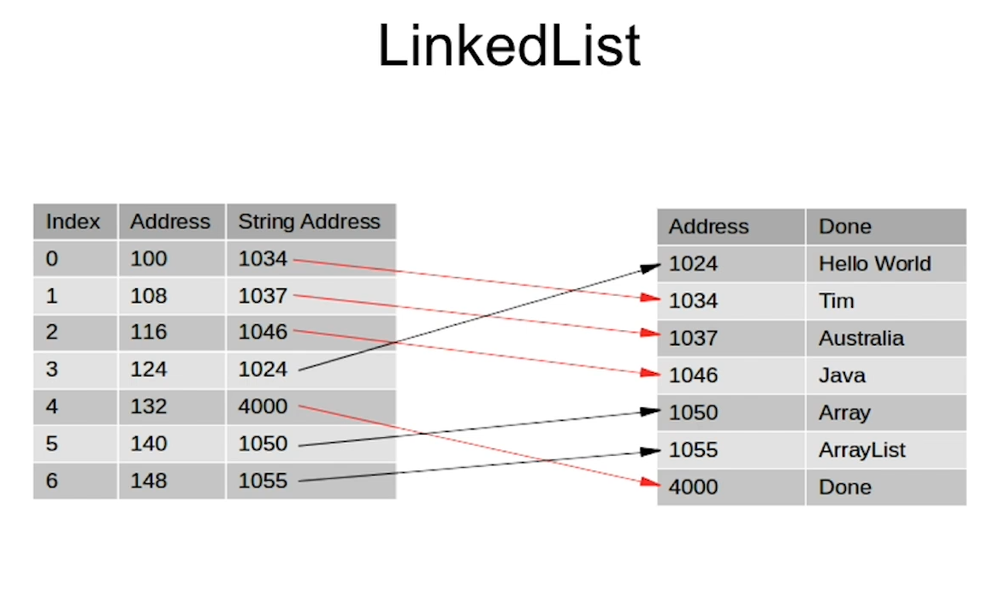
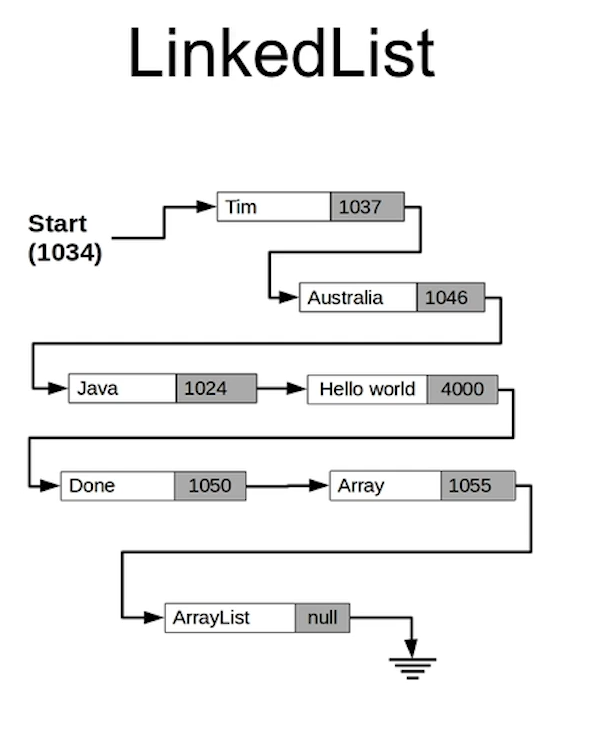

# Section 8: Arrays, Java inbuilt Lists, Autoboxing and Unboxing

Arrays, Java inbuilt Lists, Autoboxing and Unboxing

# What I Learned
* Arrays stores sequence of values
* Creating copy of old array and initializing to same size
	* `Arrays.copyOf` copies arrays
* `scanner.nextInt()` reads int input
* String is references type
* `new` operator return reference
* `Arrays.toString` converts array to string
* LinkedList allows your create and delete elements without need to create full list
* Resizing with arrays is to create new array and copy content to new array
* List is a interface
	* Thought this interface you manipulate list
* ArrayList
	* Handles resizing automatically
	* `ArrayList<String>` ArrayList holds objects of Strings
		* Arraylist is a class
* `.contains` is doing fast search for us
* Tutorial 107 practical implementation of arraylist using encapsulation
* `ArrayList<String> nextArray = new ArrayList<String>(groceryList.getGroceryList());`
	* Copying arraylist at declaration level
* `Integer.valueOf()` gets value of integer
* LinkedList Allocates 4 bytes for each integer
	* With double this would be 8 bytes
	* With Strings 8 bytes, but this time its pointer to another place
	
* ArrayList is slow when adding element into middle
	* This can be solved by linkedList
		* Every element has link to another	
		 
* ListIterator has more flexibility than normal iterator
	* Following next and previous is provided in this flexible iterator
	* REMEMBER Need to go next first to point to first record
	* stringListIterator.next()
		* Moves to next in the linkedList
	* stringListIterator.previous();
		* Goes back in linkedList
* LinkedList are good
	* When want add or remove lot of data, also good when sorting
* Java has implemented LinkedList as double linked list
	* References forward and backwards are stored
* Exceptions should be processed in some manner
	
	
TEE AUTO BOXING TUTORIALS