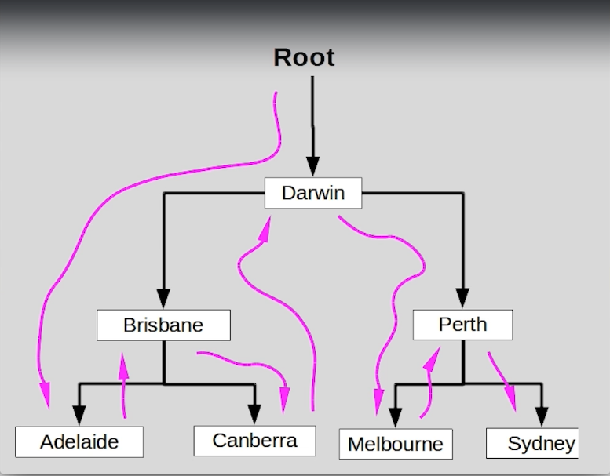

# Section 9: Inner and Abstract Classes & Interfaces

Inner and Abstract Classes & Interfaces

# What I Learned
* Interface is abstract
* ITelephone
	* I is telling its interface
* Java library is using a lot interfaces
* `Vector<~>` is one kind of list
* Implement interface or inherit from base class
	* Relations between object decides
* `List<String> values = new ArrayList<String>()`
	* Preferred way writing List
		* Maximum flexibility since List is more generic version of the list
* `public class Player implements ISaveable {...}`
	* We can use this class where ISaveable is defined in method signature
* 4 types of nested classes
	* Static nested class
		* Packaged inside outer class rather in package
	* Non Static nested class, "Inner class"
		* These types are usefully
		* Should be coupled with outer class
			* `GearBox` has inner class `Gear`
				* Inner class has meaning to be inner class
		* `.this` inside inner class refers to inner class not the outer class
		* `Gearbox.Gear first = mcLaren.new Gear(1,23.3);` creating inner class
	* Inner and outer class should not have same variable names
		* If same name of variables are found -> Shadowing declaration
	* Anonymous class
	* Local class
		* local class if not much needed outside of the class
* Abstract classes provide methods, not the implementation of those methods
	* `public abstract void eat();` forcing master class to implement these methods
	* Using abstract class as base class, inherited classes no need to redo logic
	* We can add fields and methods definitions to abstract class
* We cannot instantiate abstract class
* Abstract class
	* Can have member variables that can be inherited
	* Can have constructor
	* Fields can have any visibility
	* Can define method implementation
* Interface 
	* can have variable, but they are public static final
		* Static coz, you cannot instantiate interface
	* Cannot have constructor
	* All fields automatically public
* From Java 8 interfaces can have default methods
* Collection is perfect example using of interfaces
* Root usually means head of the list or something
* `int comparison = (currentItem.compareTo(newItem));`
	* Comparison can be made in one line, using returned value to process
* `currentItem.setNext(newItem).setPrevious(currentItem)`
	* We can short circuit lines like such
* Tree traverse

	 