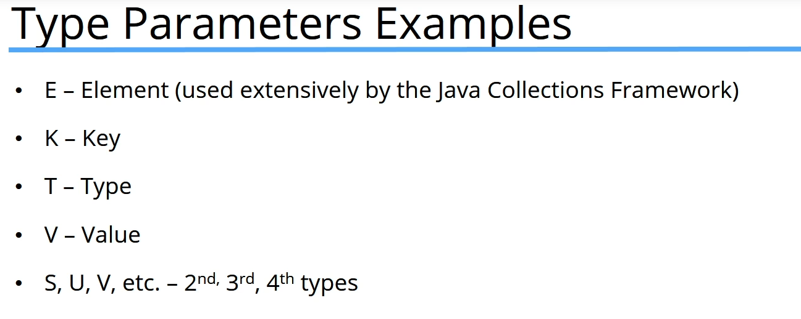

<<<<<<< HEAD
# Section 11: Naming Conventions and Packages. static and final keywords

Section 11: Naming Conventions and Packages. static and final keywords

# What I Learned
* 
* Packages are ways to group things together
* java.lang import automatically and holds Object's methods
	* This is not shown in import list
* JAR is like zip file
* If you are using same code in multiple projects you should create library and import it
* Private constructor prevents class instantiation
* Marking class final, prevents class subclassed
* Marking methods final prevents methods overridden
	* Example `public final void storePassword() `
* Static initializer is only ran once, once class is loaded to program
	* `	static {
	...
	}
	`