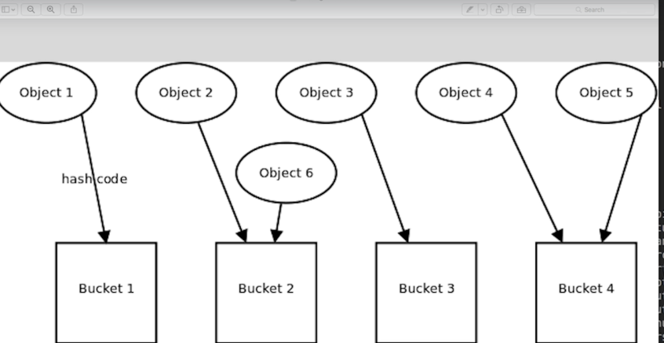

# Section 12: Java Collections

Section 12: Java Collections

# What I Learned
* Interfaces in Collection allows framework to be extended


* If declared as Collection, this can be implemented as any of type under collection
* LIST:
	* ArrayList
	* LinkedList
* Collection provides binary search
	* Object must implement Comparable
* `List<Theatre.Seat> seatCopy = new ArrayList<>(theatre.seats);` Shallow copy
	* Copying data to another object, but they are same object, reference to same object
* Deep copy is when data is fully copied, not just references
Reverse
* `Collections.reverse(seatCopy);` 
* `Collections.shuffle(seatCopy);` Shuffle
* `Collections.min(seatCopy);` Puts min based on provided natural order
* `Collections.max(seatCopy);` Puts max based on provided natural order
* `Collections.swap(list, i, j);` swaps two elements
* We can create comparator to existing class or extend comparator in class
```
	static {
        PRICE_ORDER = new Comparator<Seat>() {
        ...
        };
    } 
 ```
* Map interface is part of Java Collection, but still separated
	* Replaces dictionary
	* Map keys to values
	* No strict order
	* No duplicates keys
	* put:ing many same values, most recent get overridden
* programming defensively means exposing only what is needed
* ` public Map<String, Integer> getExits() {
        return new HashMap<String, Integer>(exits);
    } ` 
	* Nothing outside of this class, cannot change exits�


* Making class immutable means after you create it, you cannot change it
* Getters and setters should be provided if class needs them
* If class field is setter final, it should be initialized in constructor
* [Immutable Objects](https://docs.oracle.com/javase/tutorial/essential/concurrency/imstrat.html)
* Set does not have ordering
	* Cannot contain duplicates 
	* Cannot retrieve item from set 
	* Operations for HashSet are very fast
* Set theory
	* Union of set contains all element of set
	* Set canno't hold duplicate values
	* `moons.addAll(planet.getSatellites());`
	* references are stored in sets
		* not objects itself
		* reference to String is same as reference to any other object
	* Set accepts objects when .equals is not matching 
* referential equality if both point to same object, they are equal
* Objects .equal
	* String class has overridden .equals from object

	
	
* Java 7 uses **compressed pointers** [Performance](https://docs.oracle.com/javase/8/docs/technotes/guides/vm/performance-enhancements-7.html)
* HashSet or HashMap is using hashcode in which bucket object is going to



* Some information about [Object](https://docs.oracle.com/javase/8/docs/api/java/lang/Object.html#equals-java.lang.Object-) 
* .equals method should implement
	* symmetric, both should return true
```
System.out.println(rover2.equals(rover));
System.out.println(rover.equals(rover2));
 ```
* `(Arrays.asList(arrayWords)` serves bridge between array-based and collection-base APIS
* Bulk operations can be found [Set Inferface](https://docs.oracle.com/javase/tutorial/collections/interfaces/set.html)
* toString is indented for debugging
* `Collections.unmodifiableMap(list);` returns read only map

