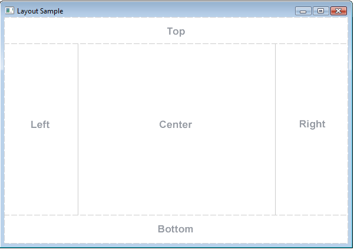

# Section 13: JavaFX

Section 13: JavaFX

# What I Learned
* JavaFX Successor to Swing
* JavaFX for making desktop app
* JavaFX is not part of Java, need to download SDK
* [JavaFX](https://gluonhq.com/products/javafx/) 
* JavaFX was thinking MVC pattern in mind
* Stage is top level container extends Window class
	* Most of application has one top level window
* Scenes makes easy to re-use container
* Stages is top level UI. The JavaFX Stage class is the top level JavaFX container
	* Scene is scene inside stage. 
* `layout` defines positioning and resizing behaviour
	* Every control computes their preferred size based on its content
* [AnchorPane] (https://docs.oracle.com/javase/8/javafx/api/javafx/scene/layout/AnchorPane.html)
* [GridPane] (https://docs.oracle.com/javase/8/javafx/api/javafx/scene/layout/GridPane.html)
* [VBox]
(https://docs.oracle.com/javase/8/javafx/api/javafx/scene/layout/VBox.html)
* [GridPane]
(https://docs.oracle.com/javase/8/javafx/api/javafx/scene/layout/HBox.html)
* `columnSpan` how many column this takes space 
* BorderPane one of most used layout
* 
* [FlowPane] (https://docs.oracle.com/javase/8/javafx/api/javafx/scene/layout/FlowPane.html)
* [StackPane]
(https://docs.oracle.com/javase/8/javafx/api/javafx/scene/layout/StackPane.html)
* [TilePane]
(https://docs.oracle.com/javase/8/javafx/api/javafx/scene/layout/TilePane.html)
* [Graphics Repository]
(https://www.oracle.com/java/technologies/java-look-and-feel-graphics-repository.html)
* [Button]
(https://docs.oracle.com/javase/8/javafx/api/javafx/scene/control/Button.html)
* Button interfaces provides default implementations how button show work
	* example interface skinnable can be overridden to make our own behaviour for this interface
* Wrapping text inside element not cutting off
* 
* Procedural programming  console programs, where start and end
* Event-driven programming where UI responses to events
* Button is pressed Event is raised in UI thread
	* Any part of program is interested handling that event?  -> Event handler
* `onAction="#onButtonClicked"/>` associate event handler
* JavaFX annotation used to associate component with code `@FXML`
* Some event handlers can take parameter
* `e.getSource()` which control was pressed
	* no need to write event handler for every compoment
* [CheckBox] https://docs.oracle.com/javafx/2/api/javafx/scene/control/CheckBox.html
* `Runnable task = new Runnable()` 
	* The Runnable interface should be implemented by anyclass whose instances are intended to be executed by a thread.
	
* [Concurrency in JavaFX](https://docs.oracle.com/javase/8/javafx/interoperability-tutorial/concurrency.htm)
* `<ListView fx:id="todoListView" onMouseClicked="#handleClickListView">`
	* fx:id="todoListView"  gives id for element
	* onMouseClicked="#handleClickListView" click handler
* [DateTimeFormatter] (https://docs.oracle.com/javase/8/docs/api/java/time/format/DateTimeFormatter.html)
* Singleton has one static method
	* Singleton data generator
* `\t` delimiter character -> Tab
* Saving large amount of data in textfile is impractical
* [String](https://docs.oracle.com/javase/7/docs/api/java/lang/String.html)
* [Package java.nio](https://docs.oracle.com/javase/7/docs/api/java/nio/package-summary.html)
* [DialogPane](https://docs.oracle.com/javase/8/javafx/api/javafx/scene/control/DialogPane.html)
* Data Binding binds control to data. Control knows when data is being updated
	* `todoListView.setItems(TodoData.getInstance().getTodoItems());`
	* Binding todoListView to observable items
* [FXCollections](https://docs.oracle.com/javase/8/javafx/api/javafx/collections/FXCollections.html)
* [DummyTextGenerator!](https://www.blindtextgenerator.com/lorem-ipsum)
* Each item in list view is displayed in cell, cell factory customizes how cells look
	* Custom cell factory
* 
* `Callback is defined with two generic parameters: the first parameterspecifies the type of the object passed in to the call method,with the second parameter specifying the return type of the method.`
* ContextMenus items are different depending on context
* Sorted list -> arrayList -> wrapping into sorted list keeps array list sorted
* [JavaFX CSS Reference Guide](https://docs.oracle.com/javase/8/javafx/api/javafx/collections/FXCollections.html)
 https://docs.oracle.com/javafx/2/api/javafx/scene/doc-files/cssref.html
* [Bloom](https://docs.oracle.com/javase/8/javafx/api/javafx/scene/effect/Bloom.html)
* Passing parent to FileChooser showOpenDialog prevents actions on actions on parent
 
  
 