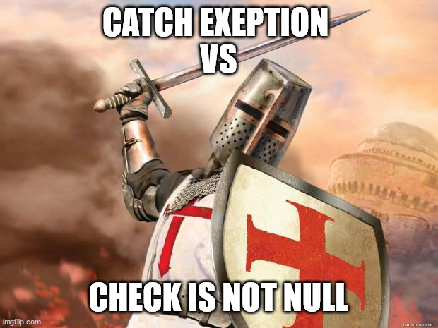
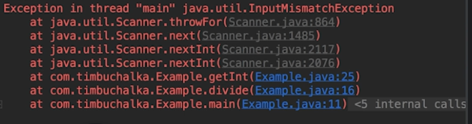

# Section 14: Basic Input & Output including java.util

Section 14: Basic Input & Output including java.util

# What I Learned

* Two approaches when using object
	1. Checking if object != null
	2. Performing operation, then if something goes wrong catch 
	exception
		* `   try {
        } catch(ArithmeticException e) {
            return 0;
        }`
* Holy war is still going on which is better to use

* Exception handling can be lot less code
* Exception means something went wrong
* Each thread has its own callstack
* When method is called its placed on stack, when method is returned is removed from stack

* its recommended work throught bottom to up when tracing stack