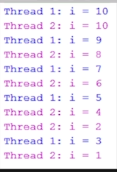

# Section 15: Concurrency in Java


Concurrency in Java

# What I Learned
* PROCESS unit of execution, each process 
	* has own memory space, also as name as HEAP
	* HEAP is not shared between processes
* THREAD is unit of execution within a process
	* each process can have multiple threads
* Every thread created by a process shares the process's memory and files
* Thread stack is personal to thread, this is created when new thread is introduced
* Why threads
	* Performing task while waiting
	* Some API require us to provide one
* `anotherThread.start();` tells JVM to start running run() method
* Need to create instance of thread and then start the thread
* Using subclass of Thread
	* We can only start() subclass once
* Creating thread with anonymous class
```
   	new Thread() {
    		public void run() {
    			System.out.println("Hello from anonymous class thread");
    		}
    	}.start();
```
* Two ways creating threads Runnable interface or subclassing
	* Runnable is more convenient
* I think Eclipse does not support ANSI color escape sequences
	* Fix in eclipse [ANSI Escape in Console](https://marketplace.eclipse.org/content/ansi-escape-console)
* `Thread myRunnableThread = new Thread(new MyRunnable()`
	* Runnable is needed to pass to thread
* With threads, they should be called as following `anotherThread.start();`
	* Not invoking `anotherThread.run();`
* Thread can be interrupted
	* Throws InterruptedException 
* Two ways threads to notice that they are interrupted
	* Catch interrupted exception 
	* Calling interrupted to check it thread being interrupted
* `	anotherThread.interrupt();` sending interrupt to thread
	* anotherThread throws exception
* Joining thread wait other thread to finish then it will continue
* `anotherThread.join();` joining to another thread
	* Join should be passed with timer, to prevent freezing if anotherThread is would not terminate 
	* Wait timer amount or another thread to finish
* Every thread has thread stack
	* Thread 1 canno't access thread 2 stack
	* Local variables are stored in thread stack
* Thread can be suspended between steps



* Race condition, when two or more are sharing same resource
* Synchronisation when thread can change or access the heap 
* When method is Synchronised only one thread can access it at the time
	* If method is being executed, other threads who want to run the method are
	suspended
	* `public synchronized void doCountdown() {` Only one can access doCountodwn at the time
	* We only want synchronize only the code which we want to be synchronized
		* To too keep code fast as possible 
	* J�in synchronisation 270