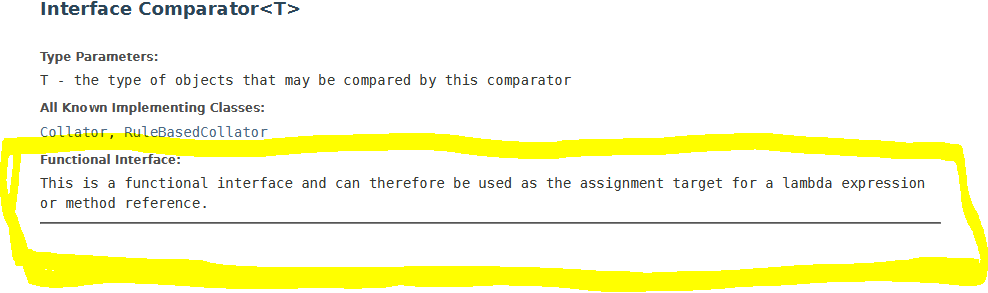
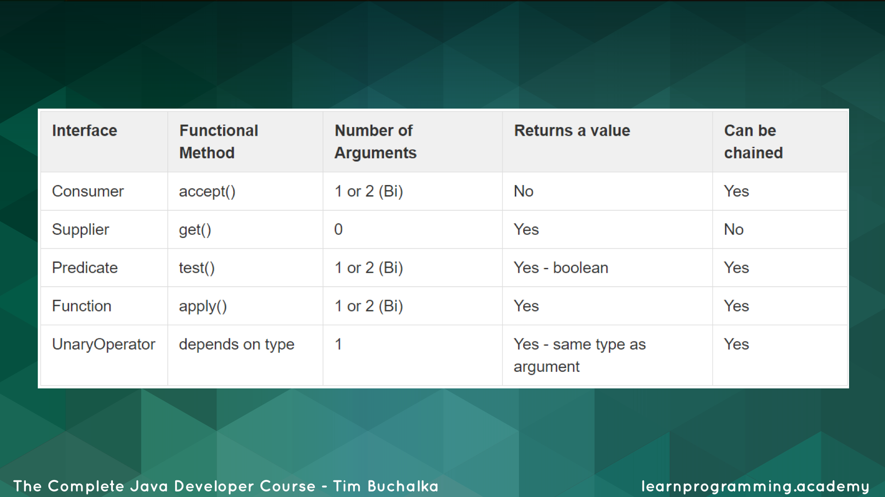
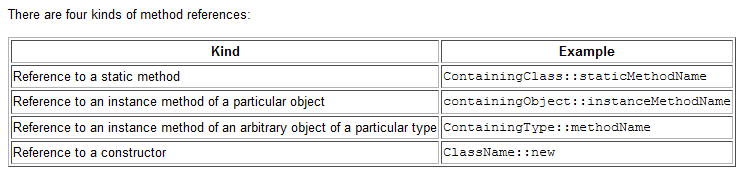

# Section 16: Lambda Expressions

Lambda Expressions

# What I Learned
* Lambda expressions were introduced Java 8
	* Easier way to deal with interfaces with one method
		* With anonymous classes
		
	``` 
		 new Thread(new Runnable() {  			
				@Override 
				public void run() {
						System.out.println("Printing from the Runnable!");	
					}
				}).start();
	```


			
* anonymous  class to create runnable OR
	* using class -> `` new Thread(new CodeToRun()).start(); ``
		
* Using lambda expressions `new Thread( () -> System.out.println("Printing from the Runnable!")).start();`
	* Lambda has three parts 
		* Argument list `()` in this case empty argument list
		* Arrow token `->`
		* Body code what we want to run, in this case `System.out.println("Printing from the Runnable!")`
* Compiler sees lambda expression ->  One of thread constructor accepts runnable parameter and it knows runnable interface has one method, which does not take any parameters -> Its able match lambda expressions argument list "no parameter" to run method 
	* Lambda needs to match to method -> lambda expressions can be used only with interfaces which contains only one method, which has to be implemented -> These interfaces are called functional interfaces
* Multiple line lambda, we are using {} if more than one statement

	```		
			new Thread( () -> {
			System.out.println("Printing from the Runnable!");
			System.out.println("line 2");
			System.out.println("This is line 3");
			}).start();
	```
	
* We can use Lambda with Comparator
	* Comparator has two abstract methods to implement
		* We just need to implement `compare(T o1, T o2)`
		* Since `equals(Object obj)` come as default method from Object
			* Therefore Comparator interface has really only one method which is needed to implemented
* To check if interface is replaceable by lambda, check the documentation
[Interface Comparator](https://docs.oracle.com/javase/8/docs/api/java/util/Comparator.html)
 

* If we see anonymous class definition that only override one method
	* We can consider using lambda
* Using lambda with sort

	```
		   Collections.sort(employees, (employee1, employee2) ->
         employee1.getName().compareTo(employee2.getName()));           
	```
* Lambdas are easy to see, what code will be ran

* `UpperConcat uc = (String s1, String s2) -> s1.toUpperCase() + s2.toUpperCase();`
	* When lambda body consist single statement which evaluates to single value, return statement is not needed
		* If in other hands if lambda consists more than one statement -> return keyword is needed
	* Here we are assigning lambda to variable and use it later
		* `Lambda expressions can be stored in variables if the variable's type is an interface which has only one method`
*  `getClass().getSimpleName()` in lambda returns name of class where lambda were written
	* `getClass().getSimpleName()` in anonymous class return empty name	
* if we want to reference variable outside anonymous class or lambda, we need declare variable as final
	* Time between creating runnable/anonymous  and using runnable/anonymous is quite much
	* References from a lambda expressions must be final or effectively final
* We don't need to use lambda expressions, we could achieve same with anonymous classes
	* To use them is up to person
* [Functional Programming](https://en.wikipedia.org/wiki/Functional_programming)

* [Consumer](https://docs.oracle.com/javase/8/docs/api/java/util/function/Consumer.html)
* Name Consumer come "object in, nothing out", therefore consumes
* forEach is Consumer type runnable interface

	```
	
        employees.forEach(employee -> {
            System.out.println(employee.getName());
            System.out.println(employee.getAge());
        });
        
	```
* We can call method which lambda maps to, in case of `Predicate` it is `test`
	* Example of testing `ageCondition.test(employee)`
* We can chain predicates`System.out.println(greaterThan15.and(lessThan100).test(50));`
* Consumer does not return value
* Supplier does not accepts any values, supplier creates objects
* Predicates return only true or false
* Function interface, we can pass string and expect string to return
* One way to define Function

	```
		
	Function<Employee, String> getFirstName = (Employee employee) -> {
            return employee.getName().substring(0, employee.getName().indexOf(' '));
        };
        
	```     
	
* Functions are useful. We can use them in parts which varies and in callbacks
	* We can chain Functions together with `andThen`
	* `Function chainedFunction = upperCase.andThen(firstName);`
	* To Chain Functions need to create composed function
		* In this case Function upperCase is called first and then returned result is passed to firstName Function
			* We could chain as many function together as we would want
		* To call composed function  we call `.apply` 
* [java.util.function](https://docs.oracle.com/javase/8/docs/api/java/util/function/package-summary.html)



* No sense to chain consumers
* Streams were introduced in Java 8
* Stream is set of object references
* Using streams have to meet 2 requirements
	* They don't change source in any way
	* They must be stateless
		* For example cannot depend on variable values on previous step
		
	
	        someBingoNumbers
                .stream()
                .map(String::toUpperCase)
                .filter(s->s.startsWith("G"))
                .sorted()
                .forEach(System.out::println);
	
	
* `.stream()` stream of items in same order as were in original file        
* `map(String::toUpperCase)` method reference
	* This is same as `map(s -> s.toUpperCase())`
* [method references](https://docs.oracle.com/javase/tutorial/java/javaOO/methodreferences.html)
* [stream](https://docs.oracle.com/javase/8/docs/api/java/util/stream/Stream.html)



* `.map(String::toUpperCase)` .map returns stream
	* Maps each item in input stream to result return from function argument
* `.filter(s->s.startsWith("G"))`
	* Filter wants predicate not function, we need to use lambda instead function reference
* `.forEach(System.out::println);` from stream accepts Consumer
	* Therefore we can pass function by reference
	* ForEach does not return value
		* They are called "terminal operation"
			* terminal operations returns void or non-stream result
			
* `Stream<String> ioNumberStream = Stream.of("I26", "I17", "I29", "O71");`
	* We can also create stream from scratch
	* Stream of String objects
* `Stream<String> concatStream = Stream.concat(ioNumberStream, inNumberStream);`
	* Concat streams
* `.distinct()` removes dublicatives like in SQL language
* `.peek(System.out::println)` since .foreach ternary operator, we can use

	```
	   Department hr = new Department("Human Resources");
	        hr.addEmployee(jane);
	        hr.addEmployee(jack);
	        hr.addEmployee(snow);
	        
	        Department accounting = new 		Department("Accounting");
	        accounting.addEmployee(john);
	
	        List<Department> departments = new 		ArrayList<>();
	        departments.add(hr);
	        departments.add(accounting);
	
	        departments.stream()
	                .flatMap(department -> department.getEmployees().stream())
	                .forEach(System.out::println);
	```
	
* `.flatMap` wants function which returns stream
	* Its called flat map since its often flatten nested list
	* We want to use flatMap when we want to operate on list, but list isen't the source. In this case object containing list
		* We create stream all of objects in those lists
* `.collect` collects element from stream to different type of result	
	* Terminal operation
	* Example we can collect items from steam to List or Set
	* `.collect(Collectors.toList());`
* We can use more specific collect version
	* `.collect(ArrayList::new, ArrayList::add, ArrayList::addAll);`
		* `ArrayList::new` Supplier, construct new ArrayList for us
			* Passing constructor
		* `ArrayList::add` Accumulator, how to add items to ArrayList
		* `ArrayList::addAll`Combiner, used to improve efficiently adding
* `.reduce((e1, e2) -> e1.getAge() < e2.getAge() ? e1 : e2)`
	* Return younger employee
	
* Stream operations are lazy evaluated 
	* We need terminal operation in the end to something to happen
	
	```

	Stream.of("ABC", "AC", "BAA", "CCCC", "XY", "ST")
                .filter(s -> {
                    System.out.println(s);
                    return s.length() == 3;
                });
	```    
	 
* Would not do any since there is no terminal operation

* Stay consistent with code style when using lambda
		