# Section 18: Back to a Few Nuts and Bolts

Back to a Few Nuts and Bolts

# What I Learned

# Overview: Date & Time (java.time)

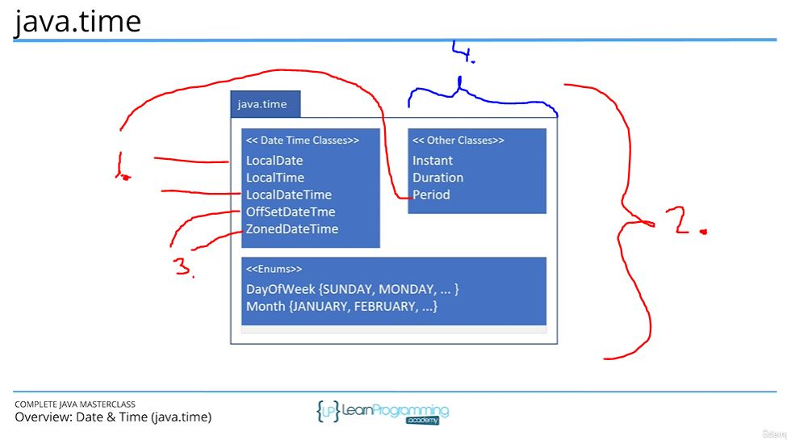

1. Give current date and time.

- Java has lot of classes for **Date** and **Time**
	- It can get confusing!

2. `java.time` which like you will use most

3. **OffSetDate** and **ZoneDate** used when need measure or store against universal standard

4. Classes for representing intervals. Most common:
	- Instant
	- Duration
	- Period

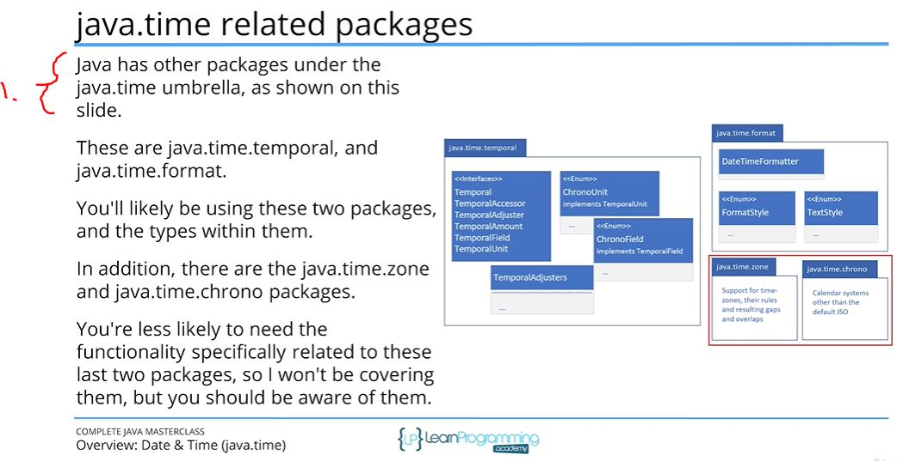

1. Under java time package there is many other related packages

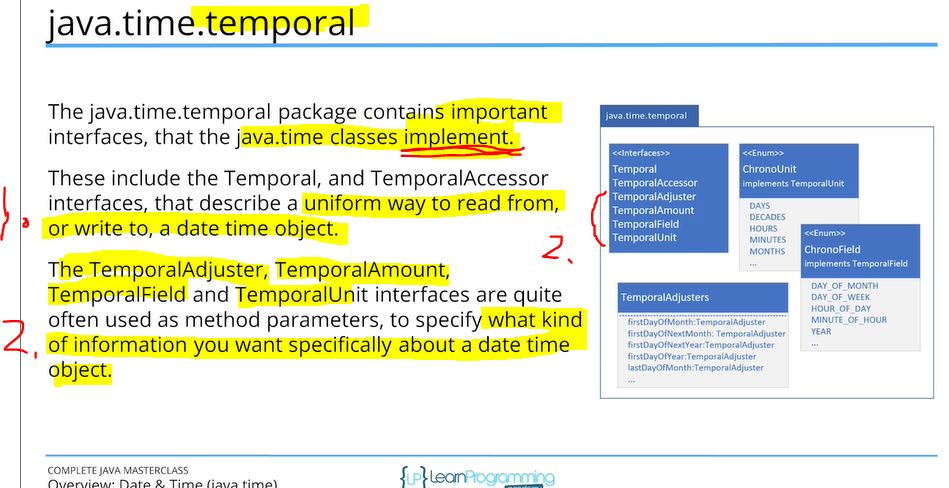

1. Common way to read and write different Java date time object.
2. **Interfaces** how you want specifically read data time object. Example what portions.  

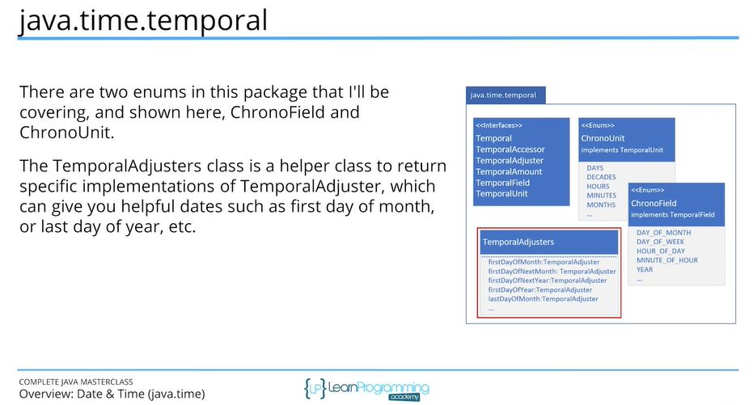

 

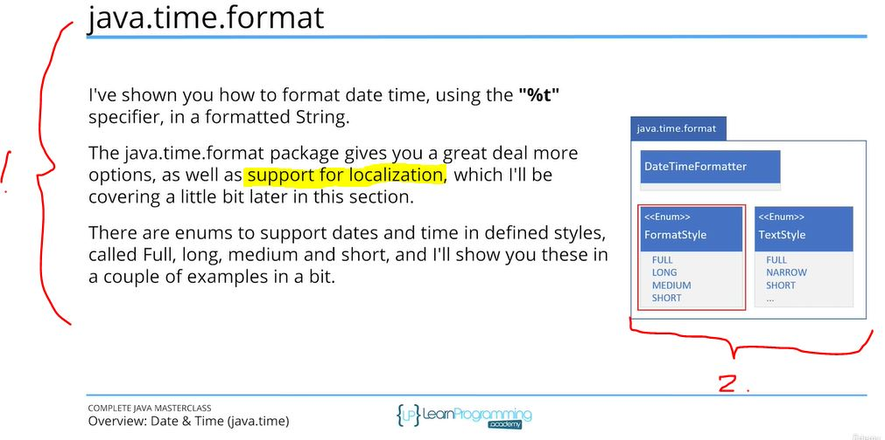

1. Formatting time correctly
	- Option to support localizations

2. There some ENUMS to support different formats for dates.

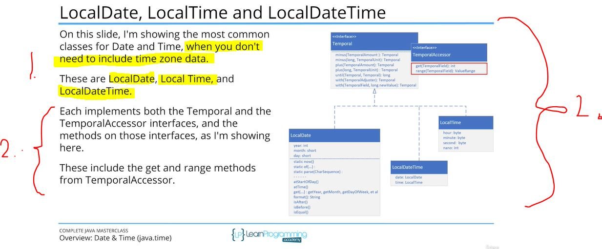

1. Most common ones when you **don't** need include time zone data

2.  Interfaces how to access and do magic to these

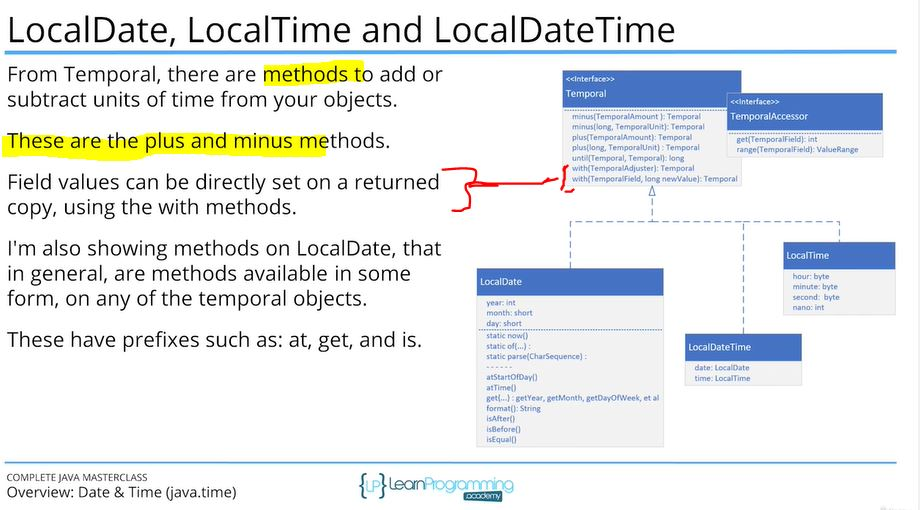

 

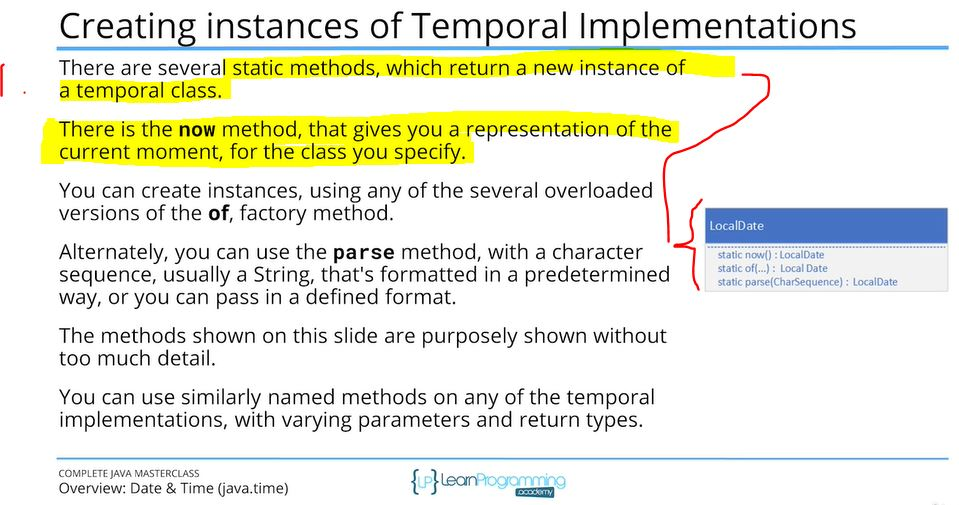

1. Different static methods to return new instance of temporal class.

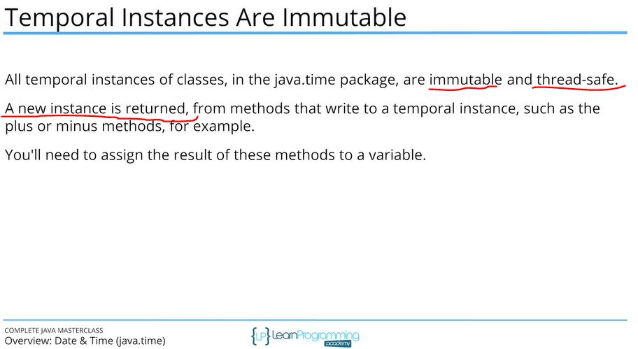

 

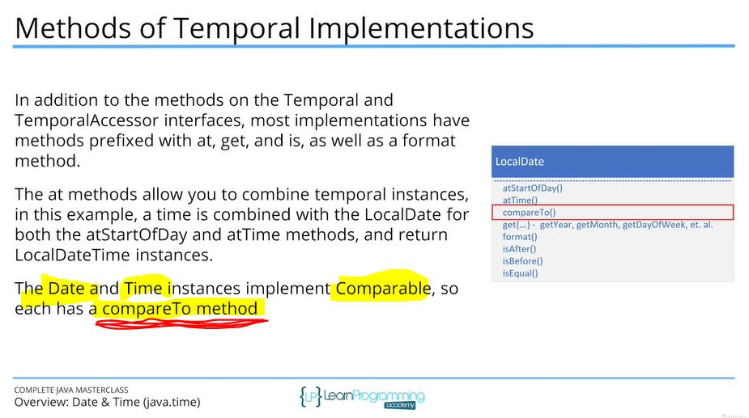

 

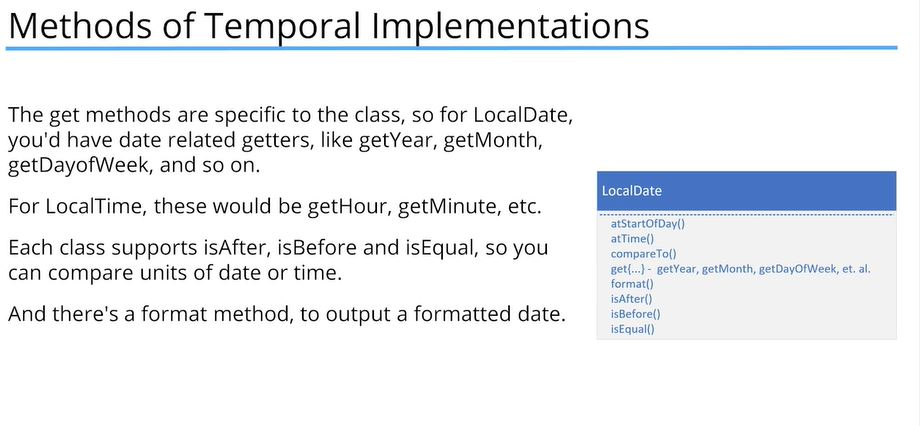

 

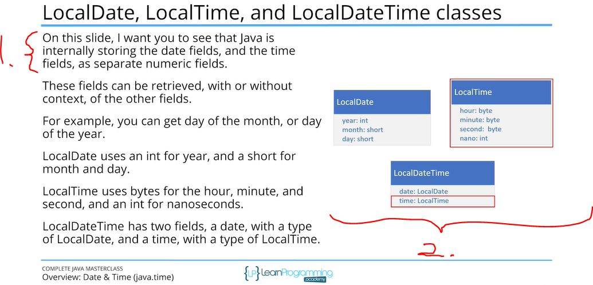

1. Locally stores **date fields**, and **time fields**, in separate numeric field

2. **LocalDateTime** includes **LocalDate** and **LocalTime**

 

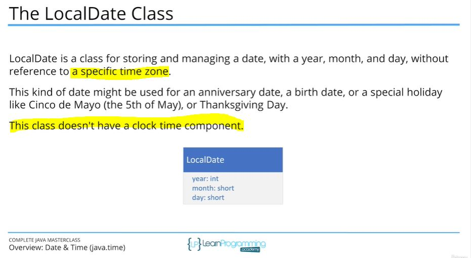

 

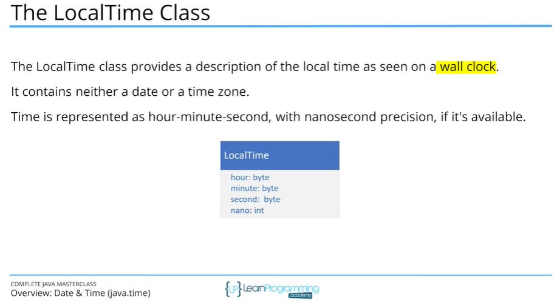

# LocalDate

- TODO proceed with this one, when structural ready. This was for fix date time bug

