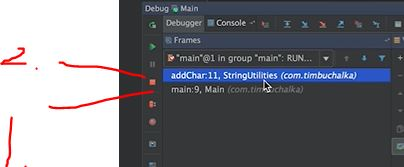
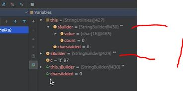

# Section 24: Debugging and Unit Testing

Debugging and Unit Testing

# What I Learned

- If we wan't to see what inside **.Class** or **Method()** we **need** **source code** for class or method.
    - **No problem** when debugging our own written class
    - **Problem** when we need access **3rd party source code** from example library. Debugging comes lot harder
        - These cases best way to debug, is to watch whats being **inputted** into to the method and whats being **outputted** from method

- To use debugger with a class, **compiled class files** needs to include **debug information** -> 3rd party class files usually don't include debugging information
    - Some libraries offer **two** version of their product. One **with** debugging information and other **whiteout** debugging information

- When using debugger application will run slower, since extra processing take place in the bugger
    - This can affect when debugging applications with network activities.  
        - Debugging **thread application** will be challenging. Timing and application is not the same when running in debug mode
        - Timeouts/Disconnects can happen etc.

- We set breakpoints to stop program flow

- We can see at this breakpoint what have been called.
1. Java runtime calls **main()**
2. Our **main()** calls our **addChar()**

1. Bug here: there is two instances of `sBuilder`