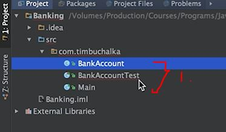
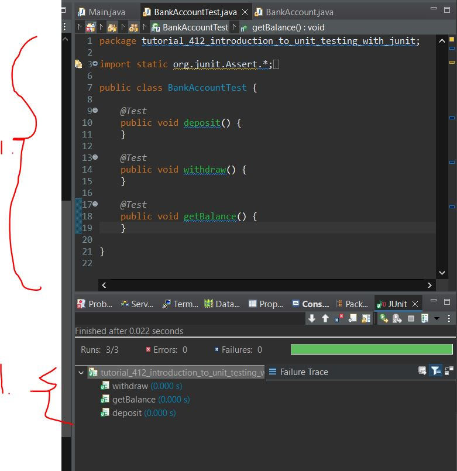

# Section 24: Debugging and Unit Testing

Debugging and Unit Testing

# What I Learned

### Introduction to Debugging 

- If we wan't to see what inside **.Class** or **Method()** we **need** **source code** for class or method.
    - **No problem** when debugging our own written class
    - **Problem** when we need access **3rd party source code** from example library. Debugging comes lot harder
        - These cases best way to debug, is to watch whats being **inputted** into to the method and whats being **outputted** from method


### More on Debugging

- To use debugger with a class, **compiled class files** needs to include **debug information** -> 3rd party class files usually don't include debugging information
    - Some libraries offer **two** version of their product. One **with** debugging information and other **whiteout** debugging information

- When using debugger application will run slower, since extra processing take place in the bugger
    - This can affect when debugging applications with network activities.  
        - Debugging **thread application** will be challenging. Timing and application is not the same when running in debug mode
        - Timeouts/Disconnects can happen etc.

- We set breakpoints to stop program flow


- We can see at this breakpoint what have been called.
1. Java runtime calls **main()**
2. Our **main()** calls our **addChar()**


1. Bug here: there is two instances of `sBuilder`


1. Here in **IntelliJ** you can see jump to current line which is being debugged.

- **Force into** can step into JDK methods. Ide assumes that we aren't interested in debugging external libraries. 


1. **Rewind Frame** will travel previous frame. In this example it would jump to the **main** method.
2. This frame would reminded

- **Remember** Everything won't be reminded
    - Static/instances variables
    - Network traffic
    - Db Changes

- This is not so popular tool!

### Field Watch Points

- Watcher are watching values when debugging. **Don't** confuse them with **Field watch points**
- Field **watch point** when variable was changed!(in intelliJ)
    - When field updates program will suspend.
    - We can config watch point for braking options
        - We could use this if we are debugging complex class, to watch where it would change.
- **Most popular** debugging tools are **breakpoint** and **watch points**. 

### Advanced Debugging

- Smart stepping into is also feature of **IntelliJ**. We can debug
    - `String result = utils.upperAndPrerix(utils.addSuffic(str));` Example here if we wan't to jump into to the last method call, we can call **Smart Stepping**.

- Here we are experimenting about, 3rd party providing sources, so we can debug this. [JTransforms](https://github.com/wendykierp/JTransforms/tree/master?tab=readme-ov-file)
    


1. Adding external Jar in Eclipse
2. Adding Source into this Additional Jar

- Even thought JTransforms **does not** have **debug information** included, but this how it should be added to project!.

- Usually IDE debugger can show method names, since it can figure out method names by on its own.


###  Introduction to Unit Testing with JUnit

- One type of testing Unit testing
    - When working with Java, Unit in this context refers to **method**.

- End of application development cycle test suite is usually ran. If it will ran 100% everything is fine, if not some changes have broke the code! 



1. Test usually have *test postfix for indication what is being testing




1. This is banned, there is **no logic to be tested** and still its green

- There test failures, when unit test fails


- We are making assertions that test are passed
    - We need to be careful, we are only covering logic which we are testing against

- Testing some example

```
	@Test
	public void dummyTest() {
	assertEquals(20, 21);
	}

```

- We are testing double with **delta** parameter 3rd parameter
    - It can give some leeway for testing doubles
```
	@Test
	public void deposit() {
		BankAccount account = new BankAccount("Tim", "Buchlka", 1000.0);
		double balance = account.deposit(200.00, true);
		assertEquals(1200.00, balance, 0);
	}
```


<!-- todo do always captions -->