# Section 25: Databases

Section 25: Databases

# What I Learned

- Will will use SQL and SQLite and then into JAVA with SQL

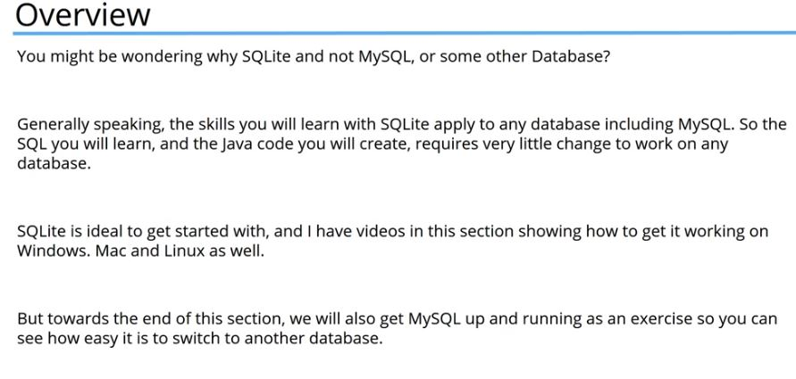

- Easy to use and easy to switch other databases

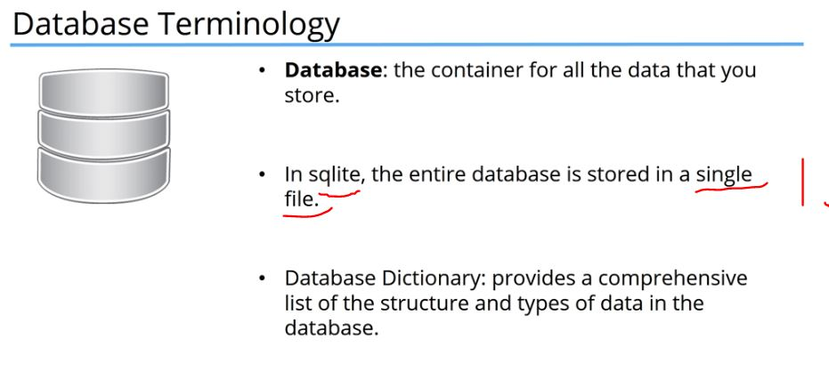

1. **SQLite** database will be in single file

- Db data in certain structure

- **Table** is collection if related data. Here you can see there is structure in tables

- There are databases without structure like **NoSQL** [NoSQL](https://fi.wikipedia.org/wiki/NoSQL)

- **Field** is basic unit of data

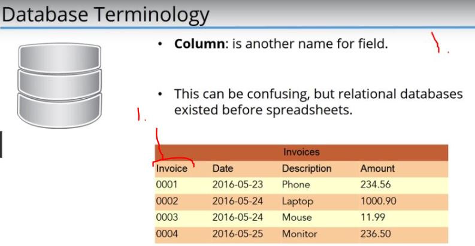

1. **Fields** are often called **Column**
    - This can be confusing, like in **Microsoft Excel** **Columns** have different meaning.
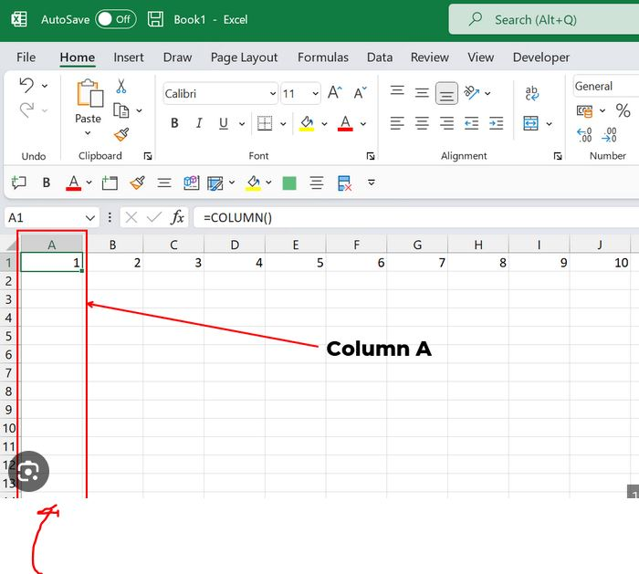

In Relational Database, Columns is often ment for name for **field**.

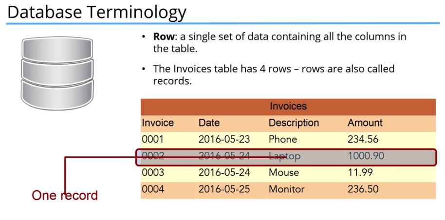

 

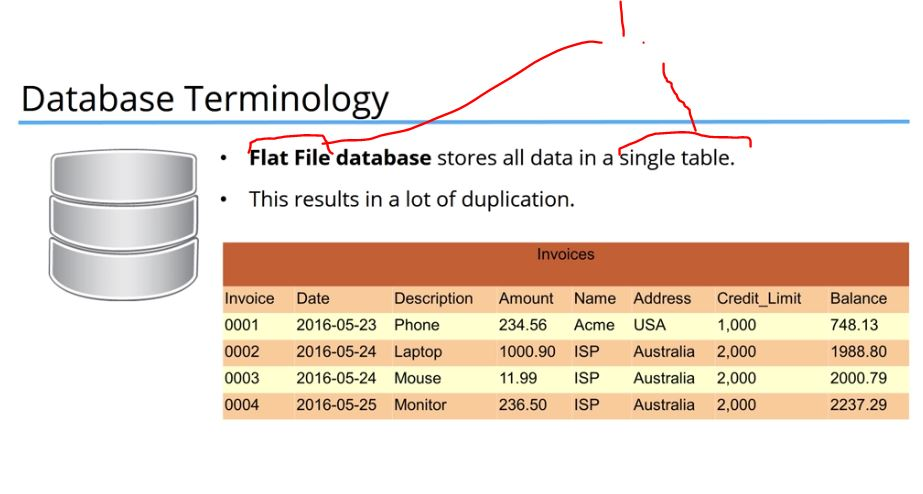

1. **Flat file database** are stored in single table 
    - A Lot of duplication of data
    - [Flat File Database](https://en.wikipedia.org/wiki/Flat-file_database)

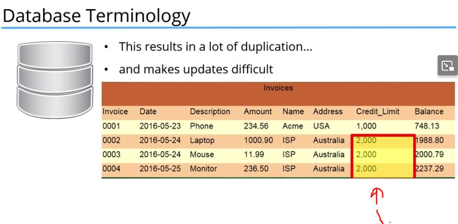

1. Lot of duplication data. If wanted raise **Credit_Limit** for **ISP**
    - Would need to change **three** data
- In old days these were popular.
    - In simple cases where data don't need to be related to each other this works perfectly well

- This extracted a bit further by taking out **customer data** to **own table** and **relating** them

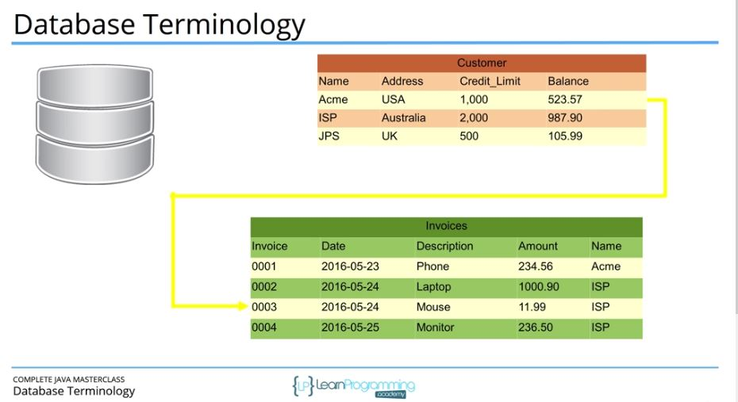

- This is called in Relational Database **Join** more specific **One To Many**

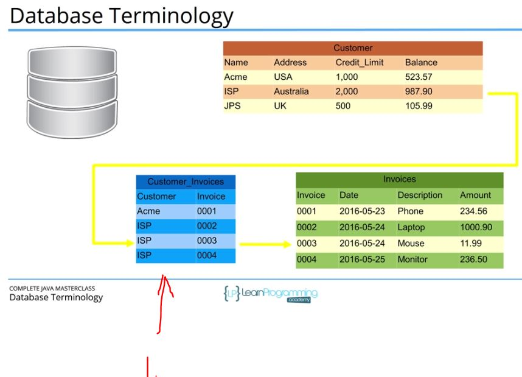

1. It's common to have linking table to link data
    - **Advantage** of this the invoice table only contains data to **Invoices**. There is no **Customer** information anymore.
- This is called **Normalisation** [Db Normalisation](https://en.wikipedia.org/wiki/Database_normalization)
    - Db Normalisation is removing all unnecessarily data and irrelevant data. More this is done, **higher** the level normalisation. You can go level **6**, but most practical level is around level **3**
- Example is this case is not high as it should be
    - Because we use **Customer Name** as the link between table.**If** Customer name changes(which is common to happen), we would need to update relevant tables

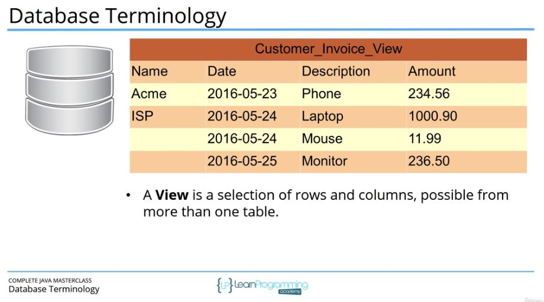

- **View** is the way to bring data together from more than one joined table.
    - In **SQLite** view cannot be used to update, some can do this, **but** has some restriction on **operations**
- **SQLite** is designed to be embedded into application

- Installing SQLite, in windows `Precompiled Binaries for Windows` and `A bundle of command-line tools for managing SQLite database files`

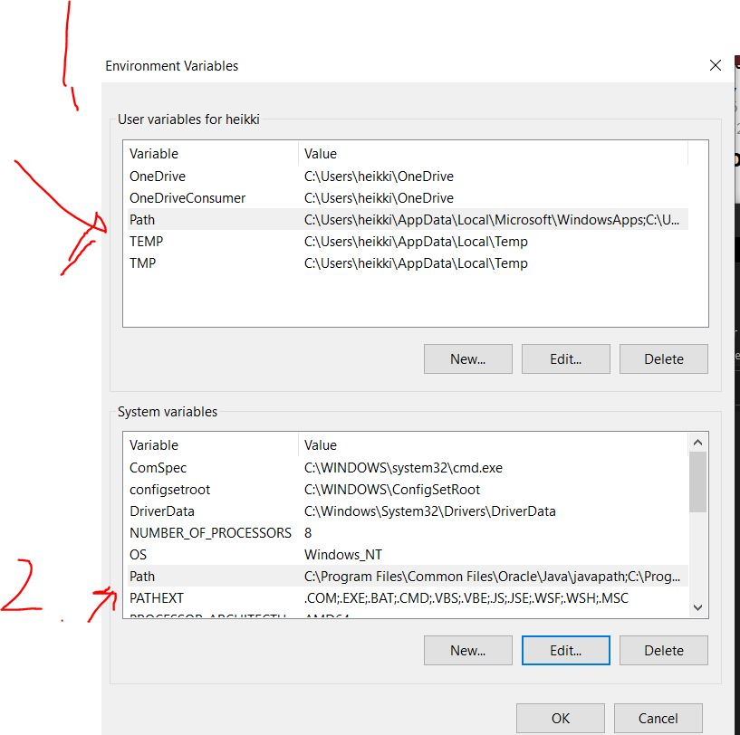

1. You should add to first **User System Variables** **Path**
2.  After that **System Variables** should be used. This can be messing up system more easily

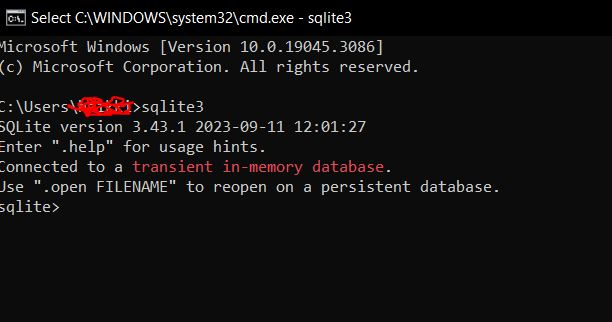

- `.quit` quitting from SQLite3

- `.headers on` SQLite configuration for headers

- When Embedding SQL into Java It's recommended to use **""** in String statements and **''** SQL statements

`Insert into contact (name, phone, emil) values('Tim', 21232, 'time@email.com');`

- In **SQLite** we can put any kind of data in any field
    - **Bit strange**

- Here It's fine to insert such, but be **careful** when switching databases, this **phone number** could be inserted into **Integer field** or would **not work** at all! 

- SQLite's command ´to backout`.backup`
    - `.backup testbackup`

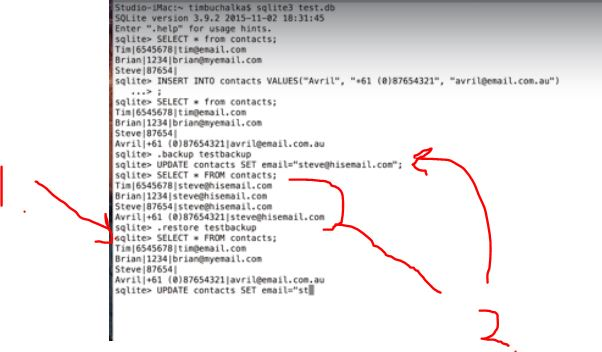

1. You can restore database using restore command `.backup testbackup`
2. `UPDATE` affecting all the data. Be careful when using **UPDATE**

- Tell tables in SQLite `.tables`
- `.schema` Tell structure of tables in SQLite
- `.dump` tells SQL creating table and inserting data
- `.exit` exits cmd

> **Mini Challenge**
> Use the appropriate SQLite command to display the structure of the database

- Answer: `.schema`

> **Mini Challenge**
> Find the title of album 367

- Answer: `SELECT name FROM albums WHERE _id = 367;`

- **Views** is common in most databases

- **Key** in table is an **Index**. Which speeds ups **searches** and **joins** in columns
    - Ordering of rows are **undefined**
        - Similar **maps** in Java
        - **Relation database** is heavily based on **set theory**

- There can be many keys in table, but one primary key

- [AutoIncrement In SQLite](https://www.sqlite.org/autoinc.html)

> **Mini Challenge**
> List all the songs that the songs from the same album appear together in track order.

- Answer: SELECT * FROM songs ORDER BY album, track

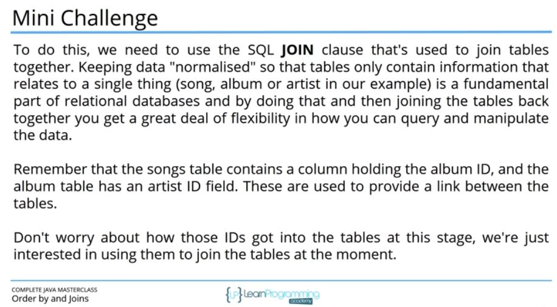

- Jäin 5:25 ja tähän minichallange

### Chapter 444. Transactions

- We can use **prepared statements** on **insert**, **update** or **delete**

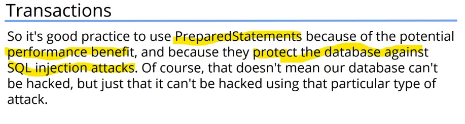

- Better performance 
- Better protection against SQL injection attacks

### Making Transactions

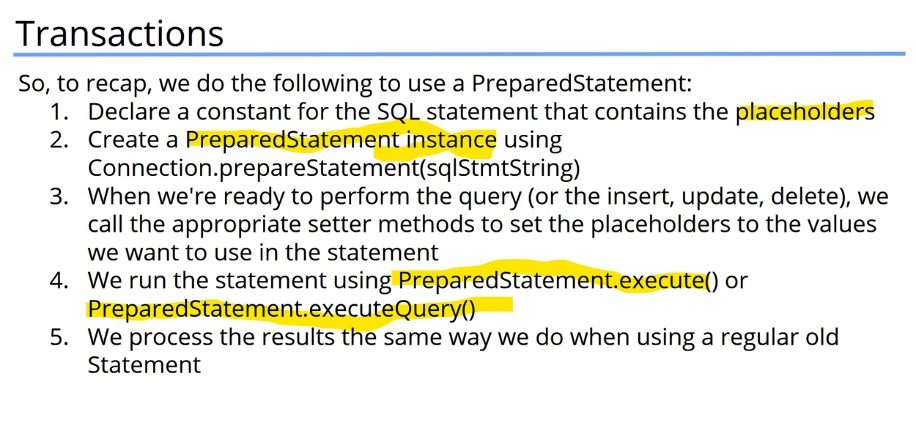

1. Put placeholders
2. Make `PreparedStatement`
3. Set **Placeholders** values
4. We execute query using `executeQuery()` or `exectute()`
5. We process results

- JDBS Connection class **auto commits** changes by default when we call `execute()` on **insert**, **update**, **delete**: It's not always what we want to. For example

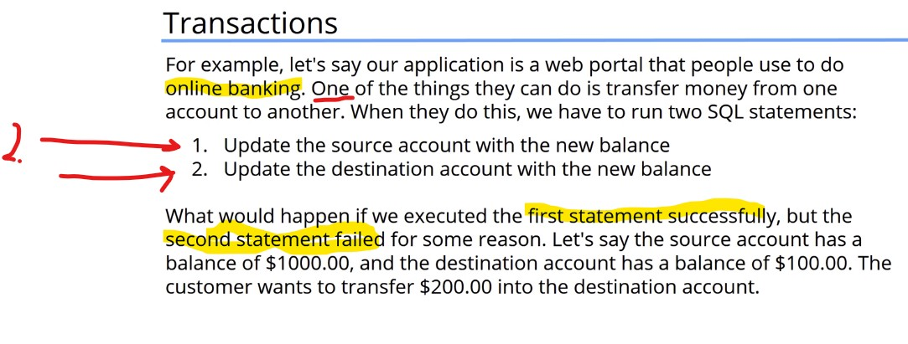

- We would need to write extra code change back into original state. We need **Tranasactions**

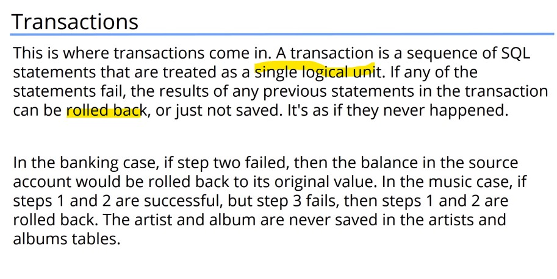

- In **transaction** world we will use name `commit` than `save`

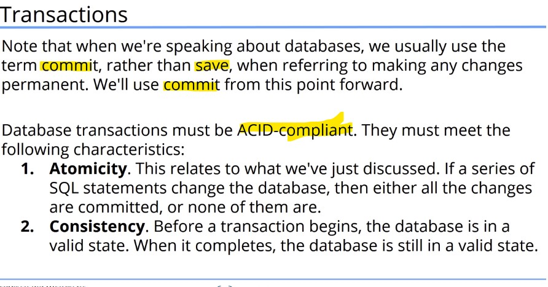

## ACID-compliant 

1. **A**tomicity
2. **C**onsistency

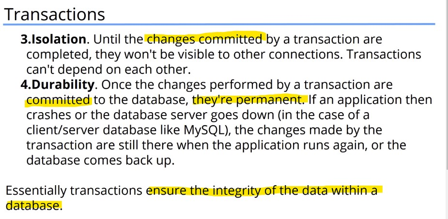

3. **I**solation
4. **D**urability

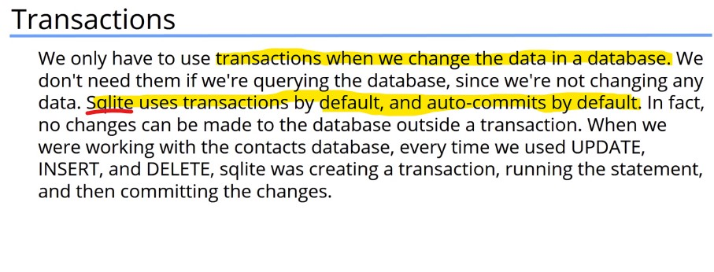

- Use **Transactions** when we change data in database.

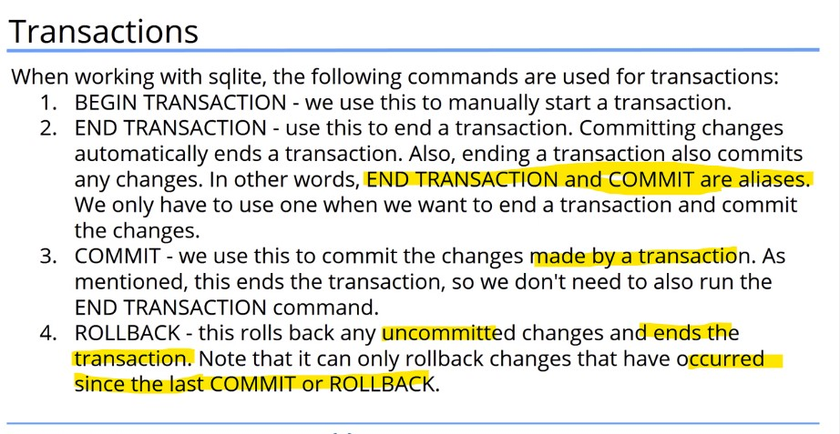

- **SQLlite**

1. `BEGIN TRANSACTION` Manually start transaction 
2. `END TRANSACTION` Manually end transaction
3. `COMMIT` Commit to changes 
4. `ROLLBACK` Rolls back uncommitted changes. Work on uncommitted changes

- If connection closes **before** **committing**, changes are rolled back.

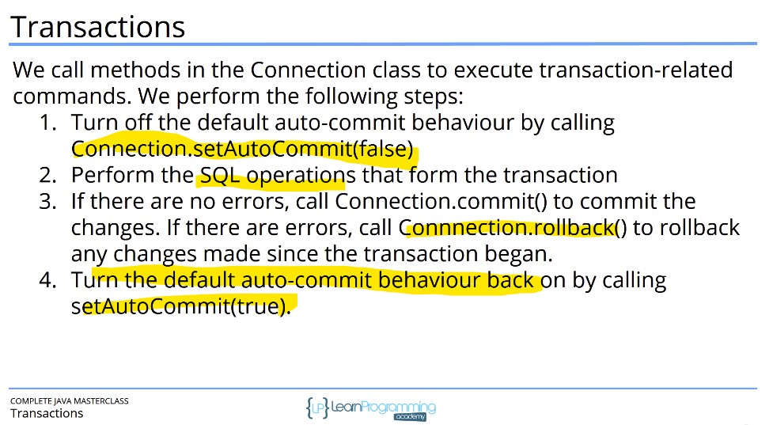

- Tee loppuun harjoituksen kanssa