# Section 42: Databases - Old content for Java 11

Databases - Old content for Java 11

# What I learned

# Section Introduction

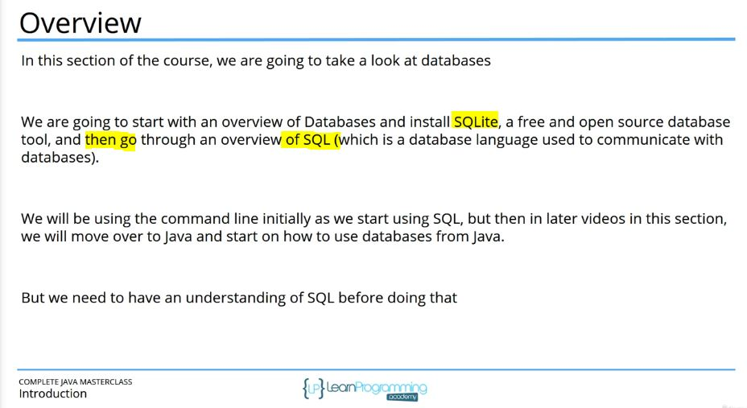

<br>

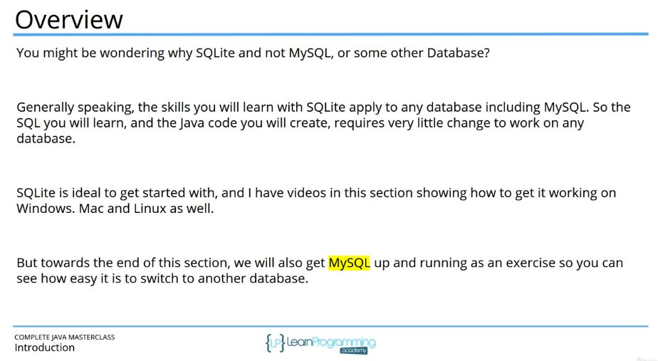

- SQLlite one of most popular software in world!

- Will will use SQL and SQLite and then into JAVA with SQL.

- Easy to use and easy to switch other databases later on.

# Database Terminology

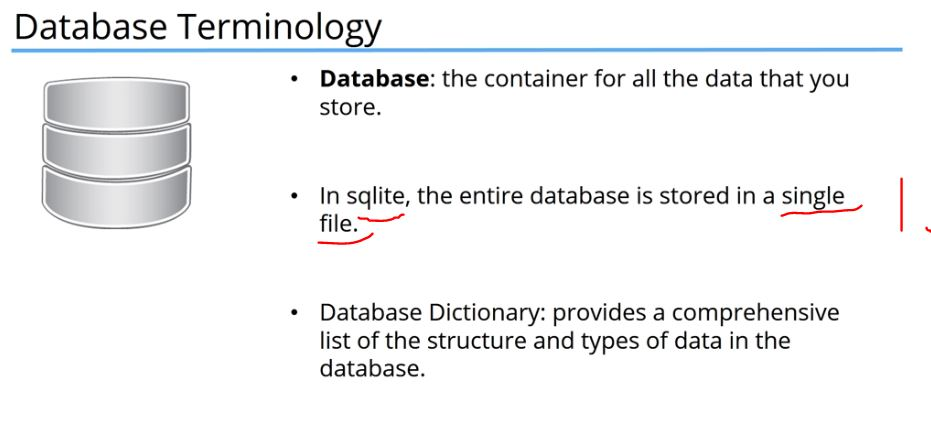

1. **SQLite** database will be in single file

- Db data in certain structure.
    - In case of **SQLite** there is master table containing this structure. Some can it call **sqlite_master** table.

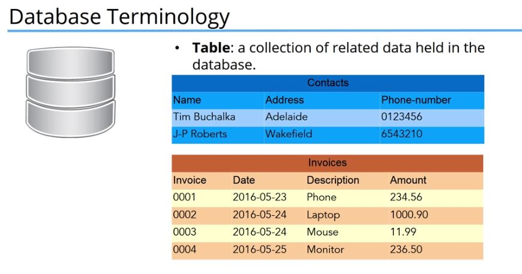

- **Table** is collection if related data. Here you can see there is structure in tables.

- There are databases **without** structure like **NoSQL**. [NoSQL](https://fi.wikipedia.org/wiki/NoSQL)

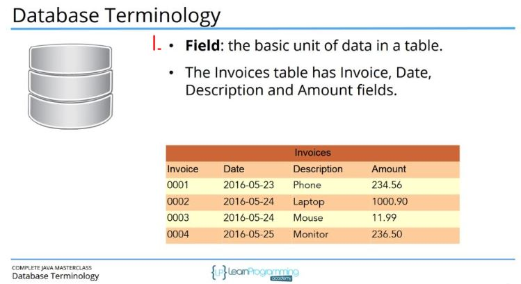

1. **Field** is basic unit of data.
    - Field types can also store **Date**, **Pics** even **Audio**.
        - These are often called **BLOB**s.        

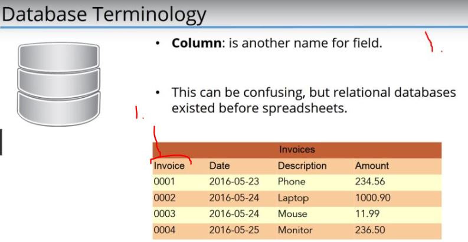

1. **Fields** are often called **Column**.
    - This can be confusing, like in **Microsoft Excel** **Columns** have different meaning.

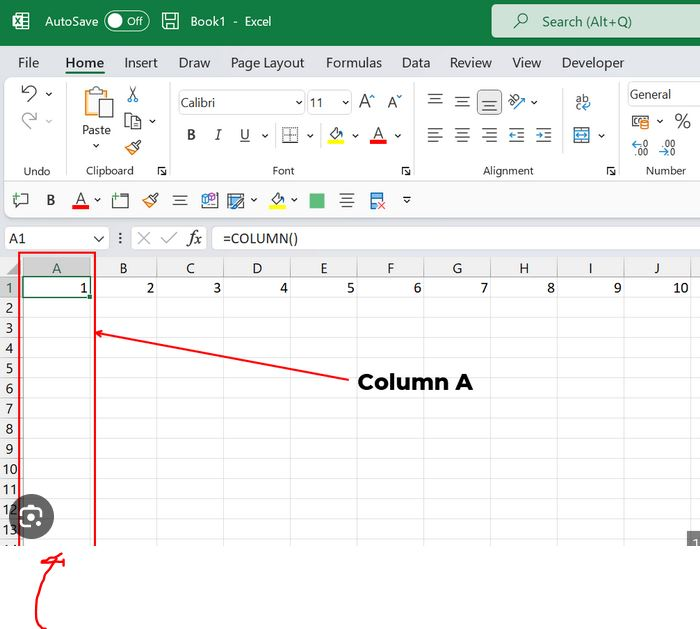

In Relational Database, Columns is often ment for name for **field**.

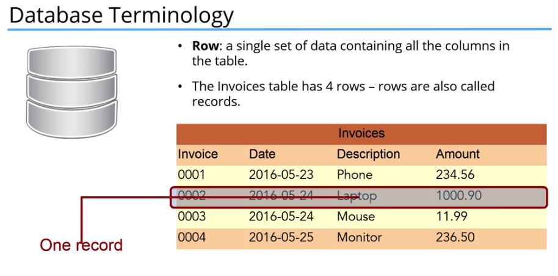

<br>

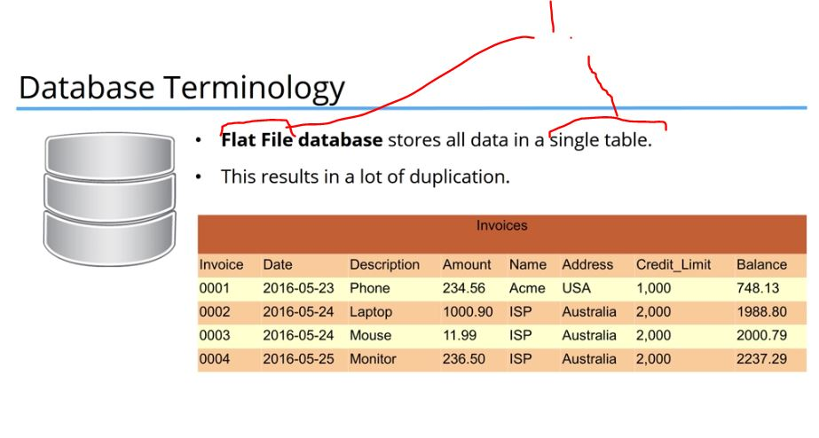

1. **Flat file database** are stored in single table.
    - A Lot of duplication of data.
    - [Flat File Database](https://en.wikipedia.org/wiki/Flat-file_database).

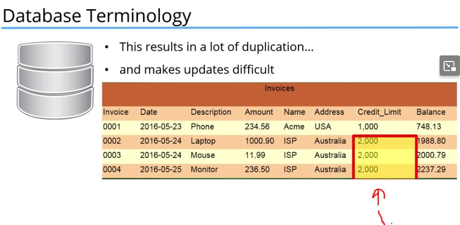

1. Lot of duplication data. If wanted raise **Credit_Limit** for **ISP**.
    - Would need to change **three** data.
- In old days these **Flat File databases** were popular.
    - In simple cases where data don't need to be related to each other this works perfectly well.

- This extracted a bit further by taking out **customer data** to **own table** and **relating** them

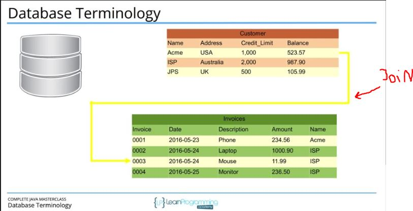

- This is called in Relational Database **Join** more specific **One To Many**

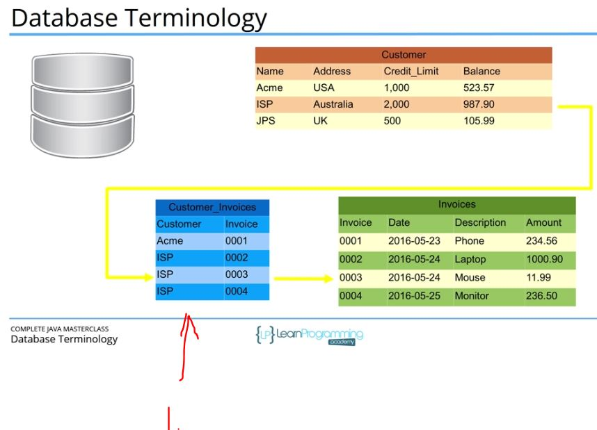

1. It's common to have **linking table** to link data
    - **Advantage** of this the invoice table only contains data to **Invoices**. There is no **Customer** information anymore.
- This is called **Normalization** [Db Normalisation](https://en.wikipedia.org/wiki/Database_normalization)
    - Db Normalization is removing all unnecessarily data and irrelevant data. More this is done, **higher** the level normalisation. You can go level **6**, but most practical level is around level **3**.
- Example is this case is not high as it should be
    - Because we use **Customer Name** as the link between table.**If** Customer name changes(which is common to happen), we would need to update relevant tables.

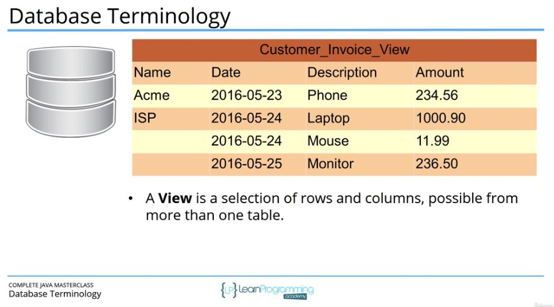

- **View** is the way to bring data together from more than one joined table.
    - In **SQLite** view cannot be used to **update data**, some can do this, **but** has some restriction on **operations**.
- **SQLite** is designed to be embedded into application.

# Install and Setup SQLite for Windows

- Installing SQLite, in windows `Precompiled Binaries for Windows` and `A bundle of command-line tools for managing SQLite database files`

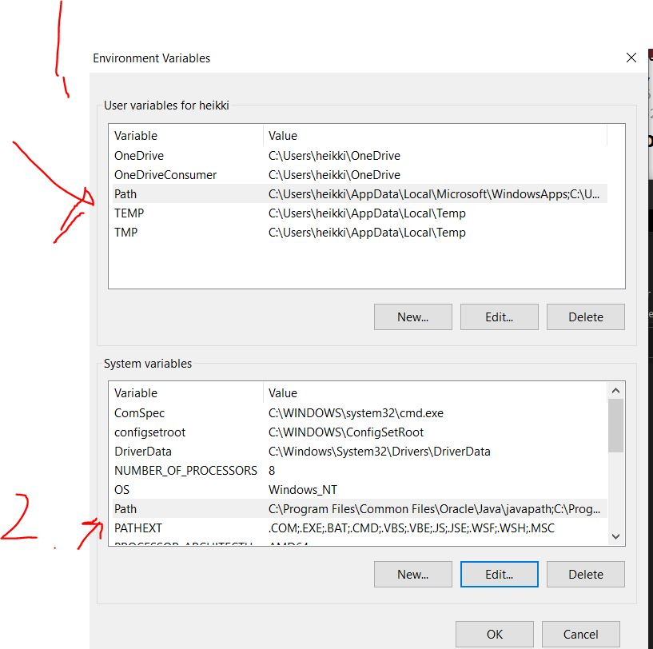

1. You should add to first **User System Variables** **Path**.
2.  After that **System Variables** should be used. This can be messing up system more easily.

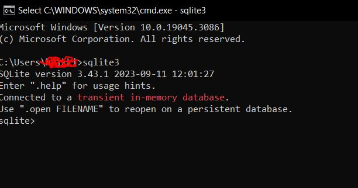

# Introduction to SQLite

- `.quit` quitting from SQLite3.
- `.help` for help.

- `.headers on` SQLite configuration for headers.
    - Show column names start of the data.
- When Embedding SQL into Java It's recommended to use **""** in String statements and **''** SQL statements.

`Insert into contact (name, phone, emil) values('Tim', 21232, 'time@email.com');`

- In **SQLite** we can put any kind of data in any field.
    - **Bit strange**.

- Creating table `CREATE TABLE contacts (name text, phone integer, email text);`.
- Inserting into table `INSERT INTO contacts (name, phone, email) VALUES('Time', '32423432', 'time@email.com');`.
- Selecting from table `Select * from contacts;`.

# More with SQLite

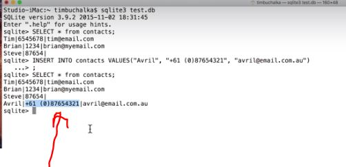

- We putted String into int column.

- SQLite lacks **ALTER** command.

- Here It's fine to insert such, but be **careful** when switching databases, this **phone number** could be inserted into **Integer field** or would **not work** at all! 

- SQLite's command to backup `.backup`.
    - `.backup testbackup`.

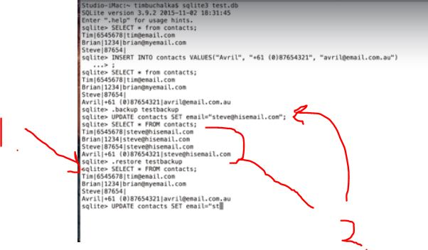

1. You can restore database using restore command `.backup testbackup`.
2. `UPDATE` affecting all the data. Be careful when using **UPDATE**.
    - `UPDATE contacts SET email="steve@hismail.com"`. This will update every row in table!     

- To Correctly use **UPDATE** use `UPDATE contacts SET email="steve@hismail.com WHERE name = "Steve"`;
    - `WHERE` part can be used with many SQL queries.

- When **DELETING** **WHERE** Should be used! `DELETE FROM contacts WHERE phone=1234`.

- **Tell tables** in SQLite `.tables`.
- `.schema` Tell **structure of tables** in SQLite.
- `.dump` **tells SQL creating table and inserting data**.
- `.exit` **exits** cmd.


1. `.dump` puts commands inside **TRANSACTION**.

# Querying Data With SQL

- Starting with given db file(Which was downloaded) `sqlite3 music.db`.

> **Mini Challenge** 
> Use the appropriate SQLite command to display the structure of the database.

- Answer: `.schema`.

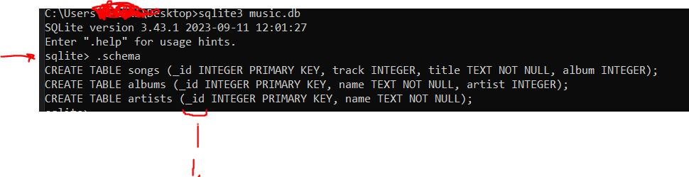

- You can see file schema is printed from downloaded file.

1. Also The naming the id with `_id` is **good habit** to start naming your database tables with this name. Some Java classes require databases require column`_id`. 

- You can check now the state of data in db. `SELECT * FROM ALBUMS;`.

> **Mini Challenge**
> Find the title of album 367

- Answer: `SELECT name FROM albums WHERE _id = 367;`.

- We could used `SELECT * FROM albums WHERE _id = 3;`.

- **Key** in table is an **Index**. Which speeds ups **searches** and **joins** in columns.
    - In **relational databases**, ordering of rows are **undefined**.
        - Similar **maps** in Java.
        - **Relation database** is heavily based on **set theory**.

- There can be many keys in table, but **one** primary key.
    - And primary key, needs to be **indexed**.

- [AutoIncrement In SQLite](https://www.sqlite.org/autoinc.html)

# SQL Order by and Joins

- If **Order** is **undefined** in relational database.
    - We can tell query the order.

- We can use to ignore case notation using following  `SELECT * FROM albums ORDER BY name COLLATE NOCASE;`.

- And same with **ASC** or **DESC** `SELECT * FROM albums ORDER BY name COLLATE NOCASE DESC;`.

- Then if you want only couple columns show, you could add more columns after `ORDER BY`
`SELECT * FROM albums ORDER BY artist,name COLLATE NOCASE DESC;`.

> **Mini Challenge**
> List all the songs that the songs from the same album appear together in track order.

- Answer: SELECT * FROM songs ORDER BY album, track.

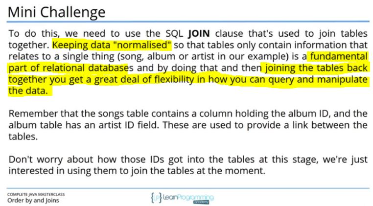

<br>

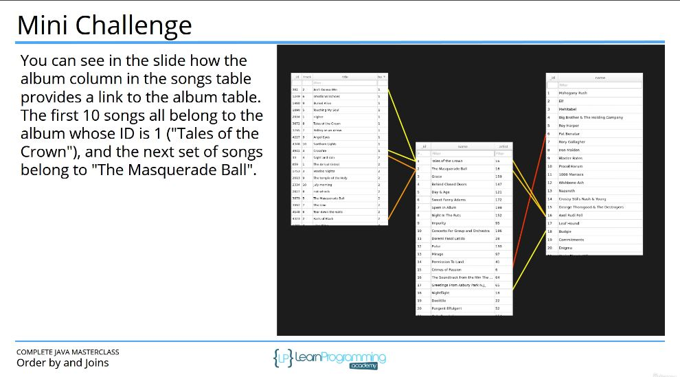

<br>

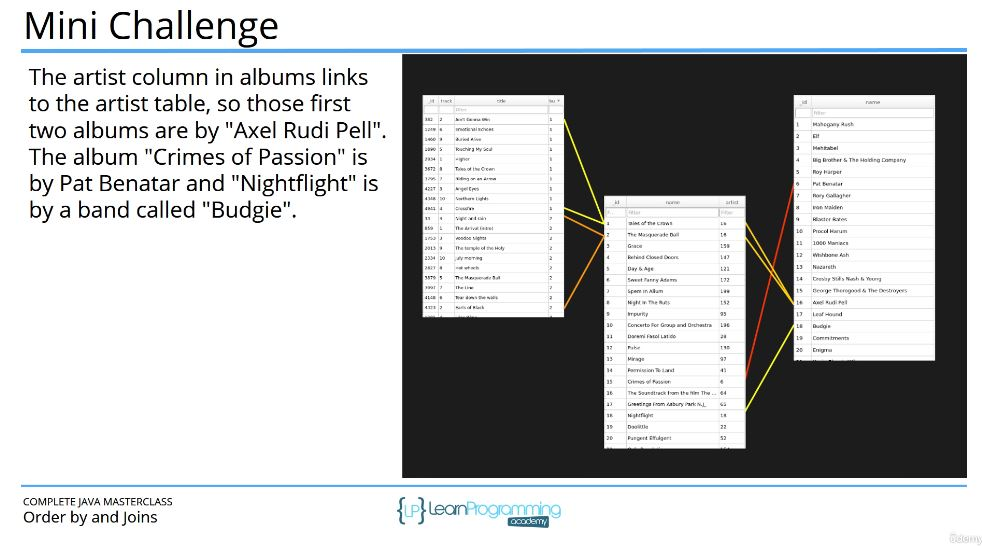

- Making the query `SELECT songs.track, songs.title, albums.name FROM songs JOIN albums ON songs.album = albums._id;`
    - You can see form what tables fields are in `songs.track`. You could leave up table name, if there is no ambiguity. Its **good habit** to prefix with table names.

- Most common **JOIN** is **INNER JOINS**, by default join is **inner joins**.

- Making the query `SELECT songs.track, songs.title, albums.name FROM songs INNER JOIN albums ON songs.album = albums._id;`.
    - When using **JOINS**, its better to be more specific with join. Meaning better to use **INNER JOIN** syntax, since some databases don't abbreviated version one.

# More Complex Joins

> **Mini Challenge**
> Produce list fo all artists, with their albums, in alphabetical order of artist name.

- My answer: `SELECT artists.name, albums.name FROM albums INNER JOIN artists ON albums.artist = artists._id ORDER BY artists.name;`

- We are making two **joins**.

``` 

SELECT artists.name, albums.name, songs.track FROM songs
INNER JOIN albums ON songs.album = albums._id 
INNER JOIN artists ON albums.artist = artists._id
ORDER BY artists.name, albums.name, songs.track; 

```
- `ORDER BY` needs be after others.

# Wildcards in Queries and Views

- Wildcard in in query. **LIKE** and `%doctor%`;

```

SELECT artists.name, albums.name, songs.track FROM songs
INNER JOIN albums ON songs.album = albums._id 
INNER JOIN artists ON albums.artist = artists._id
WHERE artists.name LIKE '%jefferson%'
ORDER BY artists.name, albums.name, songs.track; 

```

- **Stored procedures**. Stored methods in databases.
- SQLite is not client server. Its intended to embedded into programs, there fore SQLite does **not** support for **stored procedures**.


- **Views** are like **virtual tables**, you cannot update data thought views, but you can query them. At least in **SQLite**.

- Creating **View**.

```

CREATE VIEW artist_list AS 
SELECT artists.name, albums.name, songs.track, songs.title FROM songs  
INNER JOIN albums ON songs.album = albums._id 
INNER JOIN artists ON albums.artist = artists._id
ORDER BY artists.name, albums.name, songs.track; 

```

- To use **View** `SELECT * FROM artist_list;`
    - You can also filter this with `LIKE`;

- These are good for **enforcing security** in your application.
    - Like only for reading, now modifying.

- Other good use case with **Views** that you can hide data like primary key. Example with `SELECT * FORM TABLE`;

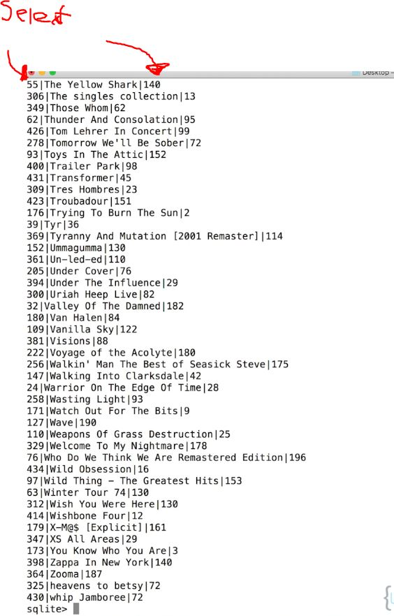

- Creating secured **VIEW** `CREATE VIEW album_list AS SELECT name FROM albums ORDER BY name;`

- If **View** was created as there is clashes of names. Table field name is being renamed, at least in SQLite.

# Housekeeping and Final SQL Challenge

- You can include **functions** for **SELECT**
    - Example ` SELECT count(*) FROM albums;`

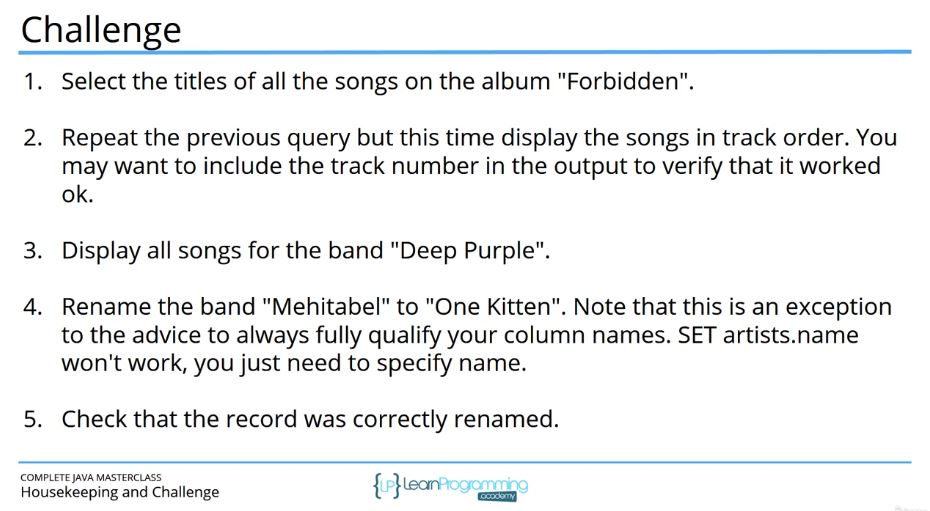

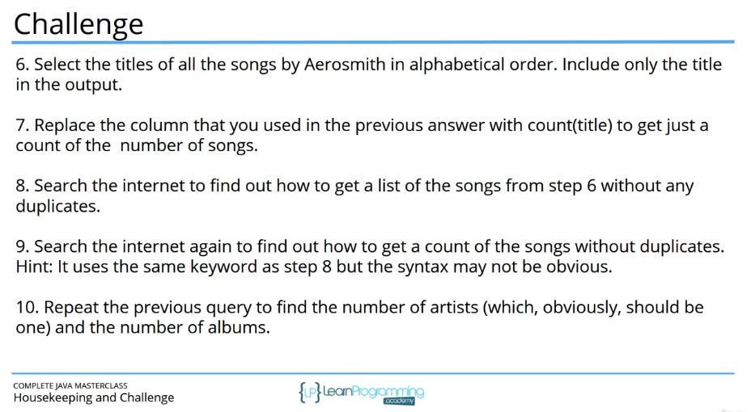

### My solutions for challenge:

1.
```
SELECT songs.title ,songs.title FROM songs 
INNER JOIN albums ON songs.album = albums._id
WHERE albums.name = 'Forbidden';
```

2.
```
SELECT songs.track ,songs.title FROM songs 
INNER JOIN albums ON songs.album = albums._id
WHERE albums.name = 'Forbidden'
ORDER BY songs.track;
```

3.
```
SELECT songs.title FROM songs 
INNER JOIN albums ON songs.album = albums._id
INNER JOIN artists ON albums.artist = artists._id WHERE artists.name = 'Deep Purple';
```

4.
```
UPDATE artists SET name = 'One Kitten' WHERE artists.name = 'Mehitabel';
```

5.
```
SELECT * FROM artists WHERE artists.name = 'One Kitten';
```


6.
```
SELECT title FROM artist_list WHERE artists = 'Aarosmith' ORDER  title;
```

7.
```
SELECT Count(title) FROM artist_list WHERE artist = 'Aerosmith';
```

8.
```
SELECT DISTINCT title FROM artist_list WHERE artists = 'Aerosmith' ORDER BY title;
```

9.
```
SELECT count(DISTINCT title) FROM artist_list WHERE artist = 'Aerosmith';
```

10.
```
SELECT count(DISTINCT album) FROM artist_list WHERE artist = 'Aerosmith';

```

# JDBC and SQLite GUI Browser

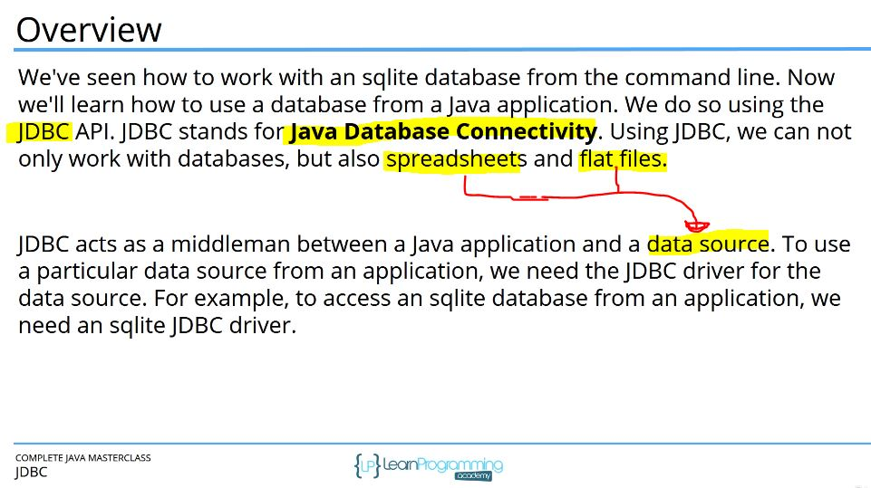

<br>

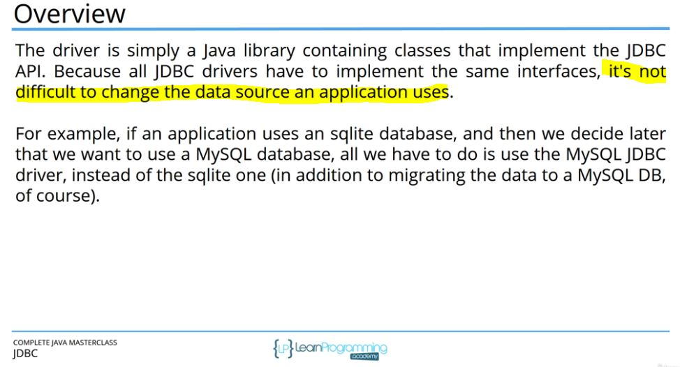

<br>

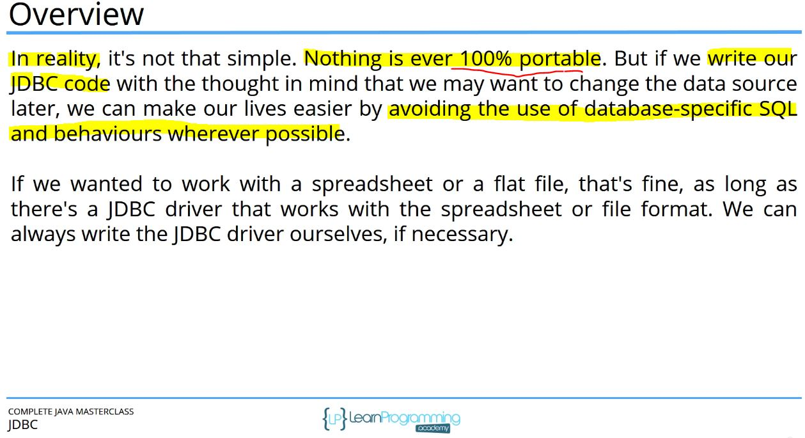

<br>

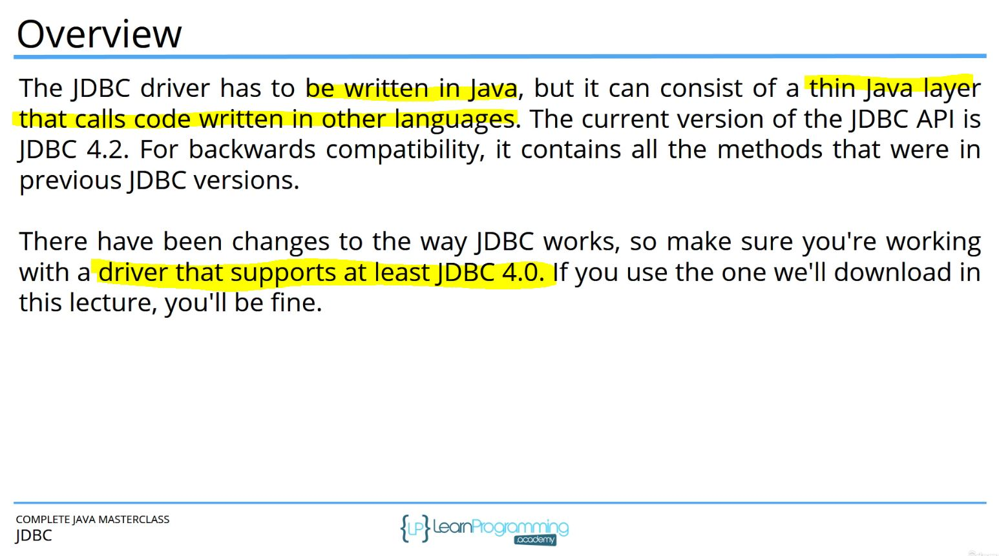

<br>

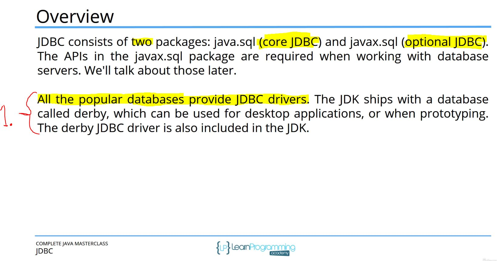

1. **JDBC** is popular so the drivers are included in many libraries.

<br>

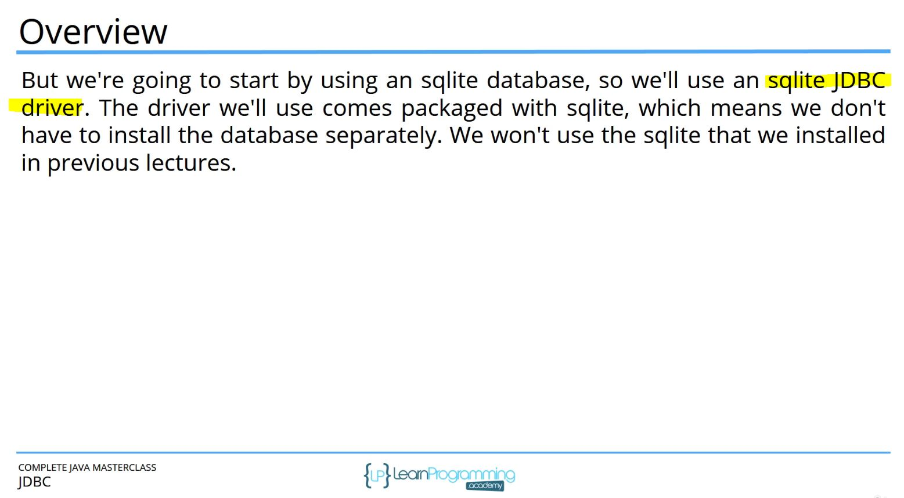

- [Jdbc Driver](https://repo1.maven.org/maven2/org/xerial/sqlite-jdbc/3.32.3.2/)
    - There is many other JDBC drivers, but this one contains db inside. We will use this one.

- We are using GUI to connect SQLite.

- [SQLite browser](https://sqlitebrowser.org/)

# Creating Databases With JDBC in Java

- All databases need connection string to connect to database
    - This form can **differ** to database to database
    - Its common to have `JDBC:`

- It can have connection attributes and users and passwords.

- To check out what is required for connection driver

- Connections **JDBC 4.0** `Connection conn = DriverManager.getConnection("jdbc:sqlite:D:\\databases\\testjava.db"); // Windows path`

- We needs to have JDBC driver need to be inside class path.

```
Connection conn = DriverManager.getConnection("jdbc:sqlite:D:\\databases\\testjava.db"); // Windows path
// Class.forName("org.sql.JDBC"); OLD way to establish.
```

- We configure **DriverManger** using SQLite. 

```		
		try {
			Connection conn = DriverManager.getConnection("jdbc:sqlite:C:\\databases\\testjava.db"); // Windows path
//			Class.forName("org.sql.JDBC");
		} catch (SQLException e) {
			System.out.println("Something went wrong: " + e.getMessage());
		}
		
```

- There is two main ways to establish connecting. 
    - First one using **driver mana**.
    - Other is using **Data Source Objects**.
        - Allows **connections pooling**.
        - Allows **distributed transactions**.
        - Portable.
        - More complex, usually in EE environments.

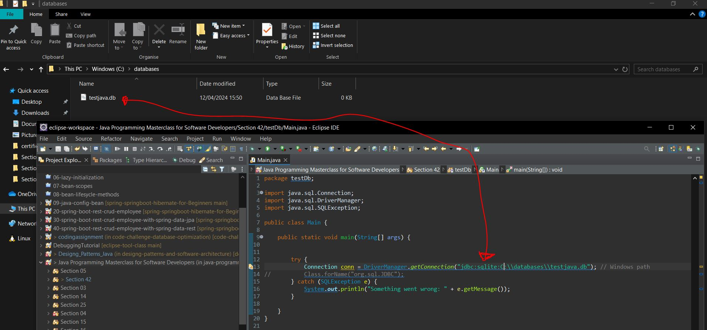

- Connection uses Database resources. Database resources should be closed when we don't need them. JVM closes them automatically, later tho.
    - Remember to close connections when you don't need them.

- Most common one latest is way to close resource is using **try-with-resource**.

```

try (Connection conn = DriverManager.getConnection("jdbc:sqlite:C:\\databases\\testjava.db")){
			
//			Class.forName("org.sql.JDBC");
			Statement statement = conn.createStatement();
			statement.execute("CREATE TABLE contacts (name TEXT, phone INTEGER, email TEXT)");
			
			
			
		} catch (SQLException e) {
			System.out.println("Something went wrong: " + e.getMessage());
		}
		
```

#  JDBC Insert, Update, Delete

-  You need to close **statements** and **connections** after don't need them.
    - First close **statements** then closes **connections**. **Statement** is associated with connection.

```

try {
			Connection conn = DriverManager.getConnection("jdbc:sqlite:C:\\databases\\testjava.db"); // Windows path
//			Class.forName("org.sql.JDBC");
			Statement statement = conn.createStatement();
			statement.execute("CREATE TABLE IF NOT EXISTS contacts (name TEXT, phone INTEGER, email TEXT)");
			
			
			
			statement.close(); // Statements should be closed before connections
			conn.close();		// Closing connections is important, but after statement is closed
			
		} catch (SQLException e) {
			System.out.println("Something went wrong: " + e.getMessage());
		}

```

- **Hard coding** SQL statements is not best to todo.
    - We should not need to write table names into code query.

- JDBC connections **default behavior** is to auto-commit changes to **database**.

- When using `UPDATE` or `DELETE`, where clause **is needed!**.
    - Example using **DELETE** `statement.execute("DELETE FROM contacts WHERE name = 'Joe'");`.

- Looping trough **results!**. Every **ResultSet** has **cursor!**. Its not same as **db cursor!**.
    - Every ResultSet has their own cursor!

- **Statement** can have only **one** active **ResultSet**.

```
   statement.execute("SELECT * FROM contacts");
   ResultSet results = statement.getResultSet();
	    while(results.next()) {
            System.out.println(results.getString("name") + " " +
                results.getInt("phone") + " " +
	            results.getString("email"));
	            }
	  results.close();		
```

- **ResultSet** is resource, we need to close it! `results.close();`.
    - We have to close **ResultSet** before close **Statement**.

- Its good practice to close **ResultsSet:s** and **Statements** ourself.

# .executeQuery() and using Constants

- We can use `executeQuery()` for less code, rather than `statement.execute("SELECT * FROM contacts");` and `ResultSet results = statement.getResultSet();`.

```
//		    statement.execute("SELECT * FROM contacts");
//	        ResultSet results = statement.getResultSet();
			ResultSet results = statement.executeQuery("SELECT * FROM contacts"); // We can also use executeQuery()
```

- We **should** use column indexes rather than **names** for retrieving data.

- Its better use constant for SQL query and connection strings. `Connection conn = DriverManager.getConnection("jdbc:sqlite:C:\\databases\\testjava.db"); // Windows path`

- Will be using such in this case:

```
	private static final String DB_NAME = "testjava.db";
	private static final String CONNECTION_STRING = "jdbc:sqlite:C:\\databases\\" + DB_NAME;
	
	private static final String TABLE_CONTACS = "contacts";

	private static final String COLUMN_NAME = "name";
	private static final String COLUMN_PHONE = "phone";
	private static final String COLUMN_EMAIL = "email";
	
```

# The Music SQLite Database

- When we want to return list of Objects. We don't wan't to return list of **ResultSet**. We can return List of artist.

# Write Java Query for Artists


- Example of **datasource**, it does not care where data is from. Database, spreadsheet or flat file.
    - We just query `queryArtists()`
```

package musicDb.model;

import java.sql.Connection;
import java.sql.DriverManager;
import java.sql.ResultSet;
import java.sql.SQLException;
import java.sql.Statement;
import java.util.ArrayList;
import java.util.List;

public class Datasource {
	

    public static final String DB_NAME = "music.db";
	private static final String CONNECTION_STRING = "jdbc:sqlite:C:\\databases\\" + DB_NAME;
	
    public static final String TABLE_ALBUMS = "albums";
    public static final String COLUMN_ALBUM_ID = "_id";
    public static final String COLUMN_ALBUM_NAME = "name";
    public static final String COLUMN_ALBUM_ARTIST = "artist";

    public static final String TABLE_ARTISTS = "artists";
    public static final String COLUMN_ARTIST_ID = "_id";
    public static final String COLUMN_ARTIST_NAME = "name";

    public static final String TABLE_SONGS = "songs";
    public static final String COLUMN_SONG_TRACK = "track";
    public static final String COLUMN_SONG_TITLE = "title";
    public static final String COLUMN_SONG_ALBUM = "album";

    private Connection conn;

    public boolean open() {
        try {
            conn = DriverManager.getConnection(CONNECTION_STRING);
            return true;
        } catch(SQLException e) {
            System.out.println("Couldn't connect to database: " + e.getMessage());
            return false;
        }
    }

    public void close() {
        try {
            if(conn != null) {
                conn.close();
            }
        } catch(SQLException e) {
            System.out.println("Couldn't close connection: " + e.getMessage());
        }
    }

    public List<Artist> queryArtists() {

        try(Statement statement = conn.createStatement();
            ResultSet results = statement.executeQuery("SELECT * FROM " + TABLE_ARTISTS)) {

            List<Artist> artists = new ArrayList<>();
            while(results.next()) {
                Artist artist = new Artist();
                artist.setId(results.getInt(COLUMN_ARTIST_ID));
                artist.setName(results.getString(COLUMN_ARTIST_NAME));
                artists.add(artist);
            }

            return artists;

        } catch(SQLException e) {
            System.out.println("Query failed: " + e.getMessage());
            return null;
        }

    }
	
}

```

- If we start using **Idex:s** instead of **ResultSet:s**. The index will be index of Result Set instead index of table.

# Executing SQL in DB Browser

- Column indexes are one based, like all in **JAVA**.

- In **REAL LIFE** queries are based on **BUSINESS LOGIC**. Meaning queries are made to match what is needed in UI!
    - The order how queries can be done and should be done is:
        - **First:** Make queries in **db tool**.
        - **Second:** Make queries to **Java code**.

# Query Albums by Artist Method

- We can hardcode SQL queries, since its singleton.

```
    public static final String QUERY_ALBUMS_BY_ARTIST_START =
            "SELECT " + TABLE_ALBUMS + '.' + COLUMN_ALBUM_NAME + " FROM " + TABLE_ALBUMS +
                    " INNER JOIN " +TABLE_ARTISTS + " ON " + TABLE_ALBUMS + "." + COLUMN_ALBUM_ARTIST +
                    " = " + TABLE_ARTISTS + "." + COLUMN_ARTIST_ID +
                    " WHERE " + TABLE_ARTISTS + "." + COLUMN_ARTIST_NAME + " = \"";

    public static final String QUERY_ALBUMS_BY_ARTIST_SORT =
            " ORDER BY " + TABLE_ALBUMS + "." + COLUMN_ALBUM_NAME + " COLLATE NOCASE ";
    
```

# Query Artists for Song method

- We are using such queries.

```
    public static final String QUERY_ARTIST_FOR_SONG_START =
            "SELECT " + TABLE_ARTISTS + "." + COLUMN_ARTIST_NAME + ", " +
                    TABLE_ALBUMS + "." + COLUMN_ALBUM_NAME + ", " +
                    TABLE_SONGS + "." + COLUMN_SONG_TRACK + " FROM " + TABLE_SONGS +
                    " INNER JOIN " + TABLE_ALBUMS + " ON " +
                    TABLE_SONGS + "." + COLUMN_SONG_ALBUM + " = " + TABLE_ALBUMS + "." + COLUMN_ALBUM_ID +
                    " INNER JOIN " + TABLE_ARTISTS + " ON " +
                    TABLE_ALBUMS + "." + COLUMN_ALBUM_ARTIST + " = " + TABLE_ARTISTS + "." + COLUMN_ARTIST_ID +
                    " WHERE " + TABLE_SONGS + "." + COLUMN_SONG_TITLE + " = \"";

    public static final String QUERY_ARTIST_FOR_SONG_SORT =
            " ORDER BY " + TABLE_ARTISTS + "." + COLUMN_ARTIST_NAME + ", " +
                    TABLE_ALBUMS + "." + COLUMN_ALBUM_NAME + " COLLATE NOCASE ";


```


# Result Set Meta Data

- These techniques **depends** on database!

- **Command Line** can query Schema from database.

- We can query **meta data** from table, about table schema.
    - Also possible to to query from **connection** class, but sometimes, like in SQLite, it won't return any data.

- [ResultSetMetaData](https://docs.oracle.com/javase/8/docs/api/java/sql/ResultSetMetaData.html)

- In code `ResultSetMetaData meta = results.getMetaData();`

# Functions and Views

- Example using **count()** from **JDBC**.

- Its recommended to use **AS** in **SQL queries**.

```

        public int getCount(String table) {
        String sql = "SELECT COUNT(*), MIN(_id) AS count FROM " + table;
        try(Statement statement = conn.createStatement();
            ResultSet results = statement.executeQuery(sql)) {

            int count = results.getInt(1);
            int min = results.getInt(2);

            System.out.format("Count = %d\n, Min = %d\n", count, min);
            return count;
        } catch(SQLException e) {
            System.out.println("Query failed: " + e.getMessage());
            return -1;
        }
    }

```

- To use **Views** inside JDBC is no different than normal usage.

- To make our view in **JDBC**

```

public boolean createViewForSongArtsists() {
    	try(Statement statement = conn.createStatement()) {
			
    		
    		statement.execute(CREATE_ARTIST_FOR_SONG_VIEW);
    		
    		return true;
    		
		} catch (Exception e) {
			System.out.println("Create View failed: " + e.getMessage());
			return false;
		}
    	
    	
    }
    
```
### Transactions

- We can use **prepared statements** on **insert**, **update** or **delete**

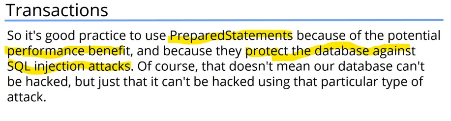

- Better performance 
- Better protection against SQL injection attacks

### Making Transactions

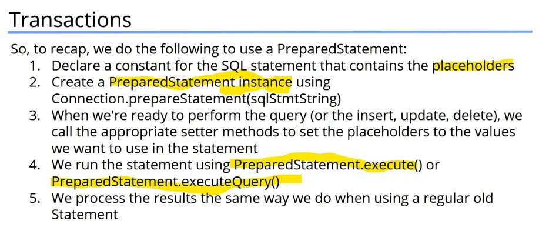

1. Put placeholders.
2. Make `PreparedStatement`.
3. Set **Placeholders** values.
4. We execute query using `executeQuery()` or `exectute()`.
5. We process results.

- JDBC Connection class **auto commits** changes by default when we call `execute()` on **insert**, **update**, **delete**: It's not always what we want to. For example

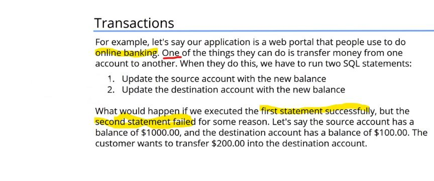

- todo 2
- We would need to write extra code change back into original state. We need **Tranasactions**

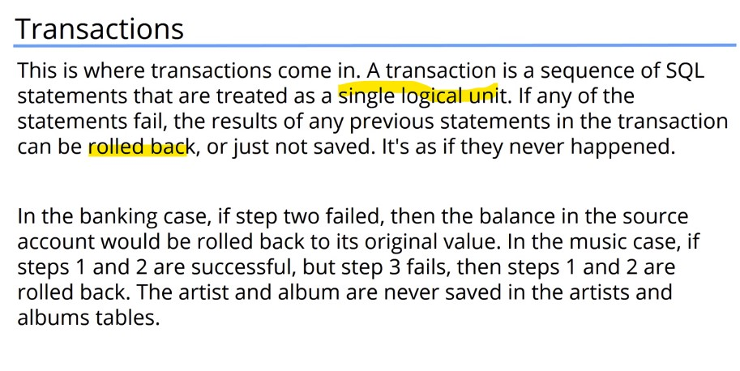

- In **transaction** world we will use name `commit` than `save`

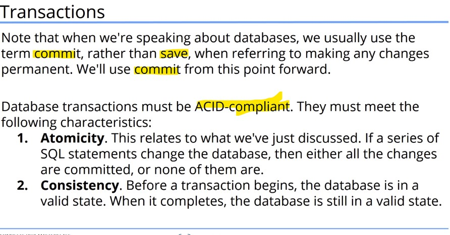

## ACID-compliant 

1. **A**tomicity
2. **C**onsistency

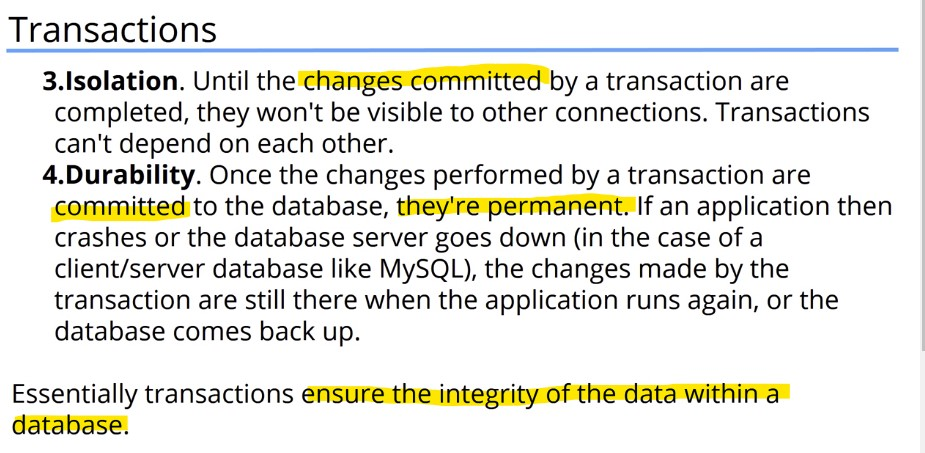

3. **I**solation
4. **D**urability

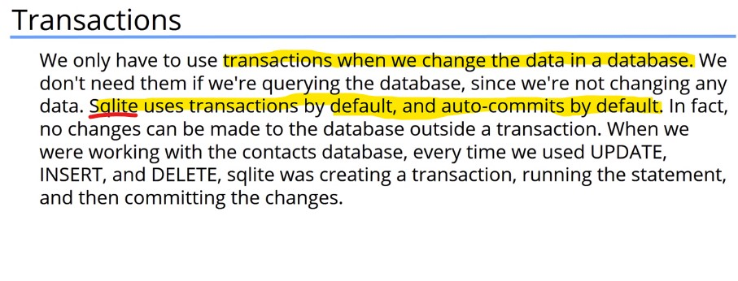

- Use **Transactions** when we change data in database.

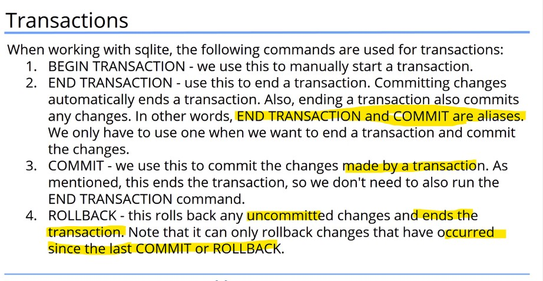

- **SQLlite**

1. `BEGIN TRANSACTION` Manually start transaction 
2. `END TRANSACTION` Manually end transaction
3. `COMMIT` Commit to changes 
4. `ROLLBACK` Rolls back uncommitted changes. Work on uncommitted changes

- If connection closes **before** **committing**, changes are rolled back.

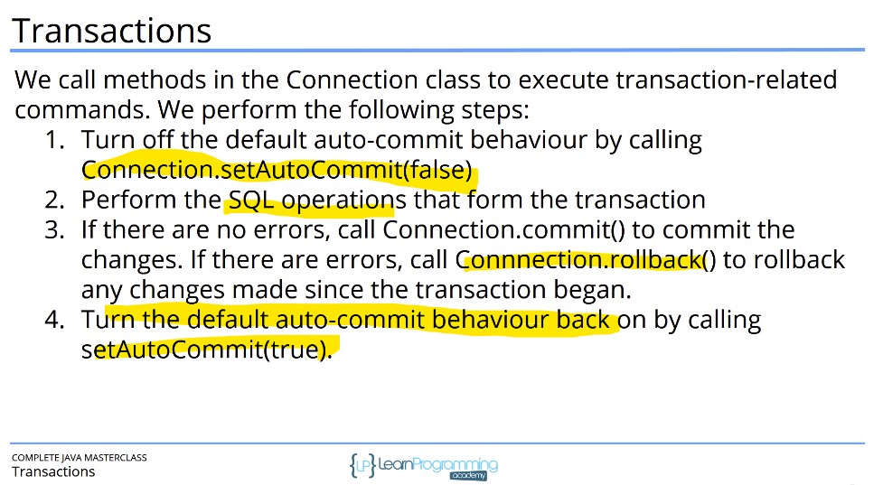

- Tee loppuun harjoituksen kanssa